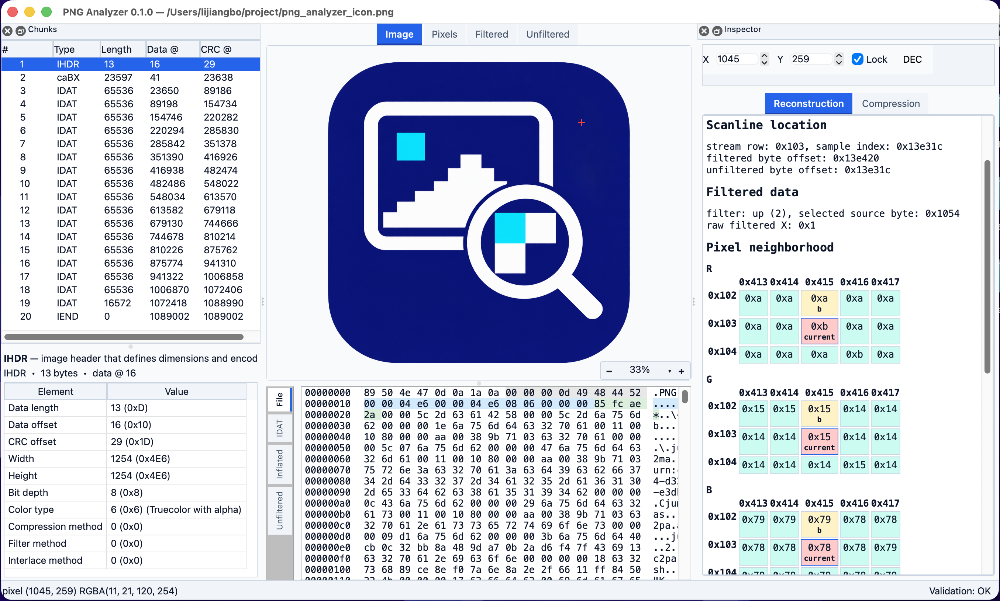

# PNG Analyzer

<p align="center">
  
</p>

PNG Analyzer is a pre-release desktop and command-line tool for inspecting
static PNG structure, reconstruction stages and bounded DEFLATE provenance.
It is designed for untrusted files: parsing uses checked arithmetic, bounded
work budgets and immutable byte-source views.

## Current capabilities

- `pnga inspect`: deterministic physical Chunk tree and JSON output.
- `pnga validate`: structural, CRC/Adler, IHDR, resource and zlib preflight
  issues with stable rule ids and offsets.
- `pnga statistics`: whole-document statistics report (JSON or CSV) with a
  versioned schema and per-section status.
- Optional Qt 6 GUI: Chunk List, file/Virtual-IDAT Hex, stage preview,
  coordinate selection, reconstruction, Block/Huffman/Decode Trace inspectors,
  a lazy whole-document Statistics inspector with deterministic JSON/CSV
  export and validation status.
- On-demand trace and pixel provenance; the default path does not retain a
  complete token trace or concatenate all IDAT payloads.

Compare, First Difference and APNG are intentionally deferred. Native
DMG/MSIX/AppImage/Flatpak installers and Qt framework deployment are
also outside the current portable archive smoke.

## GUI preview

<p align="center">
  
</p>

## Build and test

The approved workflow uses the pinned vcpkg manifest and CMake presets:

```text
python3 scripts/bootstrap.py
cmake --preset dev
cmake --build --preset dev
QT_QPA_PLATFORM=offscreen ctest --preset dev --output-on-failure
python3 scripts/verify_repository_layout.py
python3 scripts/verify_dependencies.py
```

The ASan/UBSan preset is `asan`. The fixed fuzz replay gate is:

```text
python3 scripts/run_sanitizer_fuzz_gate.py
```

## CLI quick start

After a dev build, the executable is `build/dev/apps/pnga-cli/pnga`:

```text
build/dev/apps/pnga-cli/pnga --version
build/dev/apps/pnga-cli/pnga inspect path/to/image.png --json
build/dev/apps/pnga-cli/pnga validate path/to/image.png --json
build/dev/apps/pnga-cli/pnga statistics path/to/image.png --format json
build/dev/apps/pnga-cli/pnga statistics path/to/image.png --format csv
```

`validate` returns exit code `0` for a clean report, `3` when validation
issues are reported, `2` for a malformed file that cannot be structurally
scanned, and `1` for an I/O failure.

`statistics` writes only report bytes to stdout and only diagnostics to
stderr. Reports use the versioned `pnga.statistics` schema (schema_version=1),
are UTF-8 without BOM, LF-only, end with exactly one newline and are
byte-identical for identical input regardless of locale, clock or path. Exit
codes: `0` ready, `1` I/O failure, `2` argument or format error,
`3` validation issues with usable statistics, `4` partial, cancelled or
budget-limited statistics. The GUI Statistics tab exports through the same
shared serializer, so GUI and CLI reports are byte-identical for the same
document.

## Performance and packaging gates

The deterministic in-memory performance corpus and fixed local thresholds are
run with:

```text
python3 scripts/run_performance_corpus.py --enforce-thresholds
python3 scripts/run_package_smoke.py
python3 scripts/run_release_candidate_audit.py
```

The package smoke creates a ZIP (Windows) or TGZ (macOS/Linux), extracts it in
a temporary directory and runs the packaged CLI version check. Generated
records and packages remain under `build/`.

## Documentation

- [User guide](docs/user-guide.md)
- [Trace semantics](docs/development/trace-semantics.md)
- [Development plan](docs/architecture/png-analyzer-current-development-plan-2026-08-22.md)
- [Contributing](CONTRIBUTING.md)
- [Security policy](SECURITY.md)
