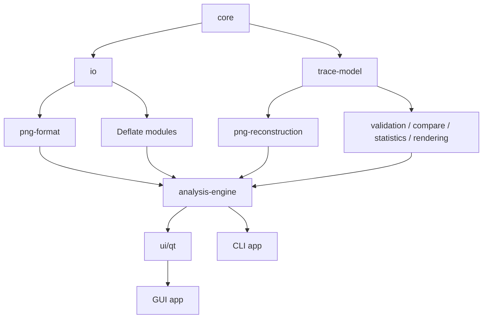

# PNG Analyzer Repository Layout Contract

> Document ID: REPOSITORY-LAYOUT-0001  
> Version: 0.1  
> Status: Accepted  
> Applies to: PNG Analyzer GitHub repository  
> Last updated: 2026-08-20

## 1. Authority

This file is the canonical repository layout and module-boundary contract for PNG Analyzer.

All contributors, Work Packages, coding Agents, build scripts and CI workflows must follow it. Before creating, moving, renaming or deleting a source directory, an Agent must read this file and `AGENTS.md`.

If another design document, issue, prompt or earlier code sample uses a conflicting path or module name, this file takes precedence. A conflict that changes the architecture rather than correcting an old spelling requires a dedicated ADR and must not be resolved inside an unrelated feature task.

## 2. Goals

The layout exists to enforce these properties:

- PNG parsing, reconstruction and Deflate analysis remain independent of Qt.
- Fast decoding, random-access indexing and deep Deflate tracing remain separate modules.
- GUI executables contain composition code rather than codec implementations.
- Every Work Package has an unambiguous writable area.
- Public APIs are visible and private implementation headers cannot be imported accidentally.
- Test corpus, generated artifacts and third-party source provenance are auditable.
- The repository can grow to APNG and plugins without reorganizing the v1 core.

## 3. Canonical repository tree

```text
png-analyzer/
├─ apps/
│  ├─ png-analyzer-gui/
│  └─ pnga-cli/
│
├─ libs/
│  ├─ core/
│  ├─ io/
│  ├─ png-format/
│  ├─ trace-model/
│  ├─ deflate-runtime/
│  ├─ deflate-index/
│  ├─ deflate-trace/
│  ├─ png-reconstruction/
│  ├─ backend-libpng/
│  ├─ analysis-engine/
│  ├─ validation/
│  ├─ compare/
│  ├─ statistics/
│  └─ rendering/
│
├─ ui/
│  └─ qt/
│     ├─ models/
│     ├─ panels/
│     ├─ widgets/
│     ├─ canvas/
│     ├─ commands/
│     └─ resources/
│
├─ plugins/
├─ sdk/
│  └─ plugin-api/
│
├─ tools/
├─ scripts/
│
├─ tests/
│  ├─ bootstrap/
│  ├─ unit/
│  ├─ integration/
│  ├─ differential/
│  ├─ golden/
│  ├─ gui/
│  ├─ fuzz/
│  ├─ performance/
│  └─ corpus/
│     ├─ smoke/
│     ├─ boundaries/
│     ├─ malformed/
│     ├─ differential/
│     ├─ performance/
│     ├─ fuzz-regressions/
│     └─ manifest.yaml
│
├─ samples/
├─ benchmarks/
│
├─ docs/
│  ├─ architecture/
│  ├─ adr/
│  ├─ formats/
│  ├─ development/
│  └─ plugin-sdk/
│
├─ third_party/
├─ packaging/
├─ cmake/
│
├─ .github/
│  ├─ workflows/
│  ├─ ISSUE_TEMPLATE/
│  └─ PULL_REQUEST_TEMPLATE.md
│
├─ AGENTS.md
├─ CMakeLists.txt
├─ CMakePresets.json
├─ CMakeUserPresets.example.json
├─ vcpkg.json
├─ REPOSITORY_LAYOUT.md
├─ THIRD_PARTY_NOTICES.md
├─ CONTRIBUTING.md
├─ SECURITY.md
├─ LICENSE
└─ README.md
```

Directories are created when their first approved Work Package needs them. Empty future directories must not be added only to make the tree look complete.

## 4. Top-level directory responsibilities

| Directory | Responsibility | Must not contain |
|---|---|---|
| `apps/` | Executable entry points, argument handling and dependency composition | PNG/Deflate algorithms, reusable widgets, persistent domain models |
| `libs/` | Qt-free reusable C++20 libraries | Qt headers, Qt targets, application entry points |
| `ui/qt/` | Qt models, docks, panels, canvas, commands and resources | PNG parsing, Inflate implementation, libpng private access |
| `plugins/` | Runtime extensions approved after the plugin API is stable | Standard PNG Chunk parsing or mandatory core functionality |
| `sdk/plugin-api/` | Stable public plugin contracts and examples | Internal engine classes or unstable implementation headers |
| `tools/` | Compiled developer tools and corpus generators | Product runtime code reachable only through a tool executable |
| `scripts/` | Bootstrap, verification, CI and release automation | Product algorithms or copied third-party programs |
| `tests/` | Automated tests, manifests and committed small fixtures | Unattributed external files or generated build outputs |
| `samples/` | Small redistributable files used in documentation and manual demos | Large performance corpus or unknown-license files |
| `benchmarks/` | Benchmark programs, scenarios and thresholds | Unit tests or release binaries |
| `docs/` | Architecture, ADRs, format notes and developer documentation | Generated application cache or dependency source trees |
| `third_party/` | Explicitly approved vendored/reference source plus provenance | vcpkg-installed packages or unrecorded copied snippets |
| `packaging/` | CPack and platform packaging definitions | Core code or platform-independent domain logic |
| `cmake/` | Shared CMake functions, dependency adaptation and build policy | Application behavior or large downloaded dependencies |
| `.github/` | GitHub Actions, issue templates and PR policy | A second build configuration that bypasses presets |

## 5. Library module responsibilities

### 5.1 `libs/core`

Contains only small, domain-independent primitives:

- Error and Result types.
- Stable IDs and handles.
- `SourceSpan`, byte/bit ranges and checked arithmetic.
- Cancellation and progress primitives that do not create threads themselves.
- Build/version information shared by CLI and GUI.

It must not become a catch-all utilities directory. PNG, Deflate, filesystem, cache and GUI behavior are forbidden here.

### 5.2 `libs/io`

Owns input access and file identity:

- `ByteSource` and bounded read interfaces.
- Regular file, memory and test implementations.
- mmap/windowed-mmap policy.
- File fingerprints, modification detection and asynchronous read primitives.

It does not understand PNG Chunk types or Deflate syntax.

### 5.3 `libs/png-format`

Owns physical and logical PNG structure:

- PNG signature and Chunk envelope parsing.
- Chunk type flags, field decoding, order metadata and CRC calculation.
- `VirtualIDATStream` and logical-to-physical span mapping.
- Static PNG and APNG Chunk data structures.

Standard critical and ancillary Chunk parsers belong here, not in `plugins/`.

### 5.4 `libs/trace-model`

Owns the backend-neutral analysis data model:

- `SemanticNode`.
- `StageArtifact` and stage identifiers.
- `Selection`.
- `Provenance` and reversible coordinate mapping records.
- Structured diagnostics and analysis events.

It must not call a decoder or depend on Qt models.

### 5.5 `libs/deflate-runtime`

Owns the fast production Inflate path built on public zlib APIs:

- Streaming Inflate wrapper.
- zlib wrapper/header and Adler-32 status reporting.
- Cancellation, bounded output and error translation.
- State-export hooks required by the index module, using supported APIs only.

It does not emit token-level traces.

### 5.6 `libs/deflate-index`

Owns large-file random-access facilities:

- Sparse checkpoint construction.
- Compressed/logical/uncompressed offsets.
- Bit alignment and 32 KiB dictionary snapshots.
- Checkpoint serialization, validation and nearest-checkpoint lookup.
- Bounded replay from a checkpoint to a requested scanline or artifact.

It must consume generic byte streams and must not assume that IDAT data is one contiguous file range.

### 5.7 `libs/deflate-trace`

Owns the instrumented Deep Trace decoder:

- Deflate block boundaries and `BFINAL`/`BTYPE`.
- Fixed and dynamic Huffman construction.
- Literal, end-of-block and length/distance tokens.
- Sliding-window source mapping and trace events.

Any code derived from zlib `contrib/puff` must retain provenance and modification records in `third_party/` and this module.

### 5.8 `libs/png-reconstruction`

Owns deterministic PNG reconstruction after Inflate:

- Pass and scanline splitting.
- All five reverse filters.
- Adam7 geometry and placement.
- Packed sample extraction and 8/16-bit native samples.
- Palette, transparency and approved delivery transforms.

It must be testable without Qt and without libpng.

### 5.9 `libs/backend-libpng`

Owns the libpng Reference Backend:

- Public libpng read API integration.
- Reference metadata, rows and final pixels.
- Error/warning capture and version reporting.
- Data adaptation into backend-neutral artifacts.

No other production module may link libpng unless a new ADR explicitly permits it. Access to libpng private structures is forbidden.

### 5.10 `libs/analysis-engine`

Owns orchestration rather than codec algorithms:

- Fast Index and on-demand Deep Trace task graphs.
- Worker scheduling, cancellation and generation IDs.
- Artifact cache, memory budgets and stale-result suppression.
- Requests such as “materialize stage S8 for row N”.
- Backend selection and publication of immutable results.

The GUI and CLI call this module instead of assembling decoder stages themselves.

### 5.11 Supporting libraries

| Module | Responsibility |
|---|---|
| `validation/` | Structural, CRC, Adler-32, semantic and specification validation |
| `compare/` | File, backend and stage comparison; first-difference location |
| `statistics/` | Chunk, filter, block, token, distance and compression statistics |
| `rendering/` | Qt-free image planes, tiled surfaces, viewport data and display-ready buffers |

`libs/rendering` may not include Qt. Qt textures, paint events and widgets belong to `ui/qt/canvas`.

## 6. Standard layout inside a library

Every `libs/<module>` directory uses this structure:

```text
libs/<module>/
├─ CMakeLists.txt
├─ README.md
├─ include/
│  └─ pnga/
│     └─ <module>/
│        └─ public-header.h
└─ src/
   ├─ implementation.cpp
   └─ internal-header.h
```

Rules:

- Only headers under `include/pnga/<module>/` are public API.
- Private headers remain under `src/` and must not be included by another target.
- Public includes use `#include <pnga/<module>/...>`.
- A module `README.md` records its responsibility, non-goals, public targets and allowed dependencies.
- Tests live centrally in `tests/unit/<module>/`; tests are not mixed into production `src/`.
- Generated headers are placed in the build tree, never written into `include/` during a build.

## 7. Dependency direction

The dependency graph must remain acyclic. The principal direction is:



The arrows indicate “lower-level capability is consumed by the next layer”; they do not authorize reverse dependencies.

Allowed direct dependencies are:

| Target | May depend on |
|---|---|
| `pnga_core` | Standard library only |
| `pnga_io` | `pnga_core`, platform file APIs |
| `pnga_png_format` | `pnga_core`, `pnga_io`, approved CRC provider |
| `pnga_trace_model` | `pnga_core` |
| `pnga_deflate_runtime` | `pnga_core`, `pnga_io`, zlib |
| `pnga_deflate_index` | `pnga_core`, `pnga_io`, `pnga_deflate_runtime`, zlib |
| `pnga_deflate_trace` | `pnga_core`, `pnga_io`, `pnga_trace_model` |
| `pnga_png_reconstruction` | `pnga_core`, `pnga_trace_model` |
| `pnga_backend_libpng` | `pnga_core`, `pnga_io`, `pnga_png_format`, `pnga_trace_model`, libpng, zlib |
| `pnga_validation` | `pnga_core`, `pnga_png_format`, `pnga_trace_model` |
| `pnga_compare` | `pnga_core`, `pnga_trace_model` |
| `pnga_statistics` | `pnga_core`, `pnga_trace_model` |
| `pnga_rendering` | `pnga_core`, `pnga_trace_model` |
| `pnga_analysis_engine` | Approved libraries above; no Qt |
| `pnga_ui_qt` | `pnga_analysis_engine`, `pnga_trace_model`, `pnga_rendering`, approved Qt modules |
| `png-analyzer-gui` | `pnga_ui_qt`, `pnga_analysis_engine` |
| `pnga` | `pnga_analysis_engine`; no Qt |

Adding a reverse edge, a new third-party dependency or a dependency cycle requires a separate architecture review.

## 8. Qt and third-party dependency boundaries

### 8.1 Qt

Qt targets are allowed only in:

- `ui/qt/**`
- `apps/png-analyzer-gui/**`
- `tests/gui/**`
- Platform packaging code that needs Qt deployment helpers

Qt includes or `Qt6::*` links anywhere under `libs/**` are a layout violation.

### 8.2 libpng

`PNG::PNG` may be linked only by:

- `libs/backend-libpng`
- Differential/reference test targets that explicitly declare oracle use

### 8.3 zlib

`ZLIB::ZLIB` may be linked only by:

- `libs/png-format`, if used as the approved CRC provider
- `libs/deflate-runtime`
- `libs/deflate-index`
- `libs/backend-libpng`
- Focused tests of those modules

### 8.4 Catch2

Catch2 is a test-only dependency and must not appear in a production target's transitive link interface.

### 8.5 Vendored source

No third-party source is copied into `libs/`. An approved derived implementation may live in `libs/`, but its pristine upstream files, license, exact commit, checksums and provenance record must live under `third_party/<source>/`.

## 9. Naming rules

- Directory names use lowercase `kebab-case`.
- CMake targets use lowercase `snake_case` with the `pnga_` prefix.
- Public CMake aliases use `pnga::<name>`.
- C++ code uses the `pnga` namespace; nested namespaces match domain concepts rather than directory punctuation.
- Public headers use lowercase descriptive names; avoid ambiguous names such as `common.h` or `utils.h`.
- Tests use `<subject>_test.cpp`.
- Benchmarks use `<subject>_benchmark.cpp`.
- Plugins and SDK directories are not created until their enabling Work Package begins.

Forbidden directory names include:

- `common/`
- `utils/`
- `misc/`
- `temp/`
- `new/`
- `old/`
- `v2/`

If code does not have a clear owner, the Agent must stop and request a layout decision instead of placing it in a catch-all directory.

## 10. Canonical replacements for old path names

The following mappings resolve inconsistencies in earlier planning documents:

| Old or conflicting path | Canonical path |
|---|---|
| `libs/deflate_trace` | `libs/deflate-trace` |
| `libs/inflate_index` | `libs/deflate-index` |
| `libs/deflate_index` | `libs/deflate-index` |
| `libs/plugin-sdk` | `sdk/plugin-api` |
| `tests/conformance` | `tests/integration` plus classified files under `tests/corpus` |
| `tests/golden-traces` | `tests/golden` |
| `plugins/chunks-standard` | Standard Chunk code moves to `libs/png-format`; only optional extensions remain in `plugins` |
| Qt code under `libs/rendering` | Qt-free data remains in `libs/rendering`; Qt canvas code moves to `ui/qt/canvas` |

These are spelling and ownership corrections and do not require a new feature ADR.

## 11. Test and corpus placement

| Test type | Location |
|---|---|
| Dependency and toolchain smoke | `tests/bootstrap/` |
| Single class/function/module | `tests/unit/<module>/` |
| Multiple production modules | `tests/integration/<scenario>/` |
| Trace Backend vs libpng | `tests/differential/` |
| Deterministic JSON/pixel/trace output | `tests/golden/` |
| Qt models and GUI smoke | `tests/gui/` |
| Fuzz targets and regressions | `tests/fuzz/` and `tests/corpus/fuzz-regressions/` |
| Performance and memory thresholds | `tests/performance/` and `benchmarks/` |
| Test inputs | `tests/corpus/<class>/` with `manifest.yaml` |

Every committed or downloaded external fixture must have provenance, license, SHA-256, expected classification and linked tests in the corpus manifest.

Generated corpus output belongs in the build tree. It must not be written back into `tests/corpus/` unless a Work Package explicitly approves adding a reviewed regression fixture.

## 12. Tracked and generated paths

The following paths are generated locally and must be ignored by Git:

```text
.deps/
build/
out/
vcpkg_installed/
CMakeUserPresets.json
Testing/
*.pnga-cache
*.pnga-index
```

Runtime analysis caches must use the operating-system cache location. The analyzer must not create sidecar cache or index files beside an opened PNG unless the user explicitly exports them.

Downloaded third-party dependencies are not stored under `third_party/`; vcpkg owns them under generated dependency/build directories.

## 13. Work Package ownership

The initial ownership mapping is:

| Milestone / WP group | Primary writable directories |
|---|---|
| WP-000 | Root governance files, `docs/adr`, `.github` templates |
| WP-00A | `cmake`, `scripts`, `third_party` metadata, dependency manifests, bootstrap tests |
| WP-001 | `apps`, `libs/core`, initial `ui/qt`, `tests/unit/core` |
| WP-100–103 | `libs/io`, `libs/png-format`, `libs/validation`, corresponding tests/corpus |
| WP-104 and GUI shell | `ui/qt`, GUI app, `tests/gui` |
| M2 Reference Backend | `libs/backend-libpng`, `libs/analysis-engine`, `libs/rendering` |
| M3 Reconstruction | `libs/trace-model`, `libs/png-reconstruction` |
| M4 Large-file access | `libs/deflate-runtime`, `libs/deflate-index`, performance tests |
| M5 Deep Trace | `libs/deflate-trace`, authorized `third_party/zlib-puff` records |
| M6 Compare/release | `libs/compare`, `libs/statistics`, `packaging`, optional plugin/API directories |

An issue's explicit `allowed_paths` remains narrower than this table. This table does not authorize an Agent to modify every directory in a milestone.

## 14. Automated enforcement

`WP-00A` or `WP-001` must add `scripts/verify_repository_layout.py`. It must fail when it detects:

- An unknown top-level directory.
- Underscores or uppercase letters in source directory names.
- A `libs/<module>` without its required CMake file, README or public/private layout.
- Qt includes or links under `libs/`.
- libpng linked outside approved targets.
- Catch2 leaked into a production target.
- Includes of another module's `src/` header.
- A tracked file under a generated path.
- Vendored source without an entry in `third_party/sources.lock.yaml`.
- Corpus data without a manifest entry.
- An old path name listed in Section 10.

The standard verification commands are:

```bash
python3 scripts/verify_repository_layout.py
cmake --preset dev
cmake --build --preset dev -j
ctest --preset dev --output-on-failure
```

CI must run the layout verifier before compilation so violations fail quickly.

## 15. Agent stop conditions

An Agent must return `BLOCKED` instead of making an arbitrary directory decision when:

- Required code has no owner in Sections 4 or 5.
- The task needs to create a new top-level directory.
- The task creates a forbidden dependency edge.
- Completion requires Qt under `libs/`.
- Completion requires libpng outside `backend-libpng` or a test oracle.
- A third-party snippet lacks exact provenance or license.
- The requested change conflicts with this contract and cannot be reduced to a mapping in Section 10.

The blocking report must propose the smallest ADR or follow-up Work Package needed to resolve the conflict.

## 16. Change procedure

Minor corrections that do not move ownership or change dependency direction may update this file directly in a documentation PR.

The following changes require a dedicated ADR and repository-layout update before implementation:

- Adding or removing a production module.
- Moving responsibility between modules.
- Adding a top-level source directory.
- Allowing Qt in a previously Qt-free layer.
- Adding a new production package manager or unpinned dependency path.
- Changing the plugin ABI boundary.
- Introducing a dependency cycle or reverse dependency.

Every accepted change must update this file, affected module READMEs, Work Package path constraints and the automated layout verifier in the same PR.

