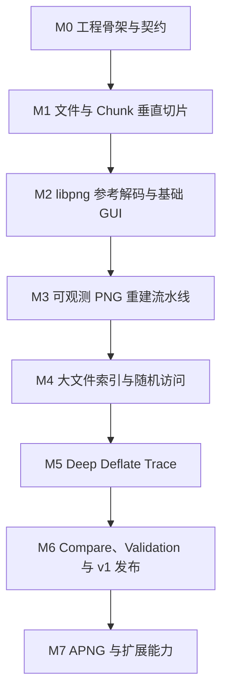

# PNG Analyzer Agent 可执行开发计划 v0.1

> 本计划把《PNG Analyzer 桌面软件架构设计 v0.1》转换为 Agent 可以逐项实施、逐项验证、失败时安全停止的工程工作包。计划面向 GitHub 开源仓库，默认技术栈为 C++20、Qt 6、CMake、libpng 与 zlib。

## 1. 执行原则

### 1.1 不是让 Agent “实现整个模块”

Agent 的任务必须是可验证的最小工作包（Work Package，WP）。每个 WP 应满足：

- 单一主要目标。
- 正常情况下可在半天至两天内完成。
- 依赖关系明确，不能依靠未合并代码。
- 修改目录和禁止修改范围明确。
- 开始前就写明验证命令和验收条件。
- 即使 Agent 失败，也不会破坏已经通过的主干能力。

禁止使用以下任务描述：

- “完成 PNG 解码器”。
- “实现高性能架构”。
- “把 GUI 做出来”。
- “优化代码并修复相关问题”。

应改写成：

- “实现只读 `ByteSource` 与越界检测，并通过空文件、短文件、超大 offset 测试”。
- “实现五类 PNG reverse filter，不包含 Adam7，并与 golden row corpus 逐字节比较”。
- “为 Chunk Tree 增加 Selection→Hex span 同步，不修改 decoder”。

### 1.2 每个 WP 必须形成闭环

```text
读取约束
→ 确认输入与不变量
→ 编写或补充测试
→ 实现最小改动
→ 执行分层验证
→ 检查 diff 与边界情况
→ 输出证据报告
→ PASS / BLOCKED / FAIL
```

Agent 不允许用“代码看起来正确”作为验证，也不允许把失败测试删除、降级或标记为跳过来通过验收。

## 2. 开发前必须固定的工程约束

在执行功能任务前，先把这些内容写入仓库，供后续 Agent 每次读取：

### 2.1 `AGENTS.md`

至少包含：

- Core libraries 不得依赖 Qt。
- GUI 不得直接解析 PNG 或调用 zlib 私有结构。
- 所有文件 offset、length、rowbytes 使用 checked arithmetic。
- 不得把多个 IDAT data 复制拼接成一个大 buffer。
- libpng 是 Reference Backend，不是完整 Trace Backend。
- 新增 decoder 行为必须有 differential/golden test。
- 不允许修改第三方源码，除非 WP 明确授权。
- 不允许顺便重构不相关目录。
- 所有 public API 变化必须更新 ADR 或接口文档。

### 2.2 Architecture Decision Records

需要先冻结：

- ADR-0001：C++20 + Qt 6 + CMake。
- ADR-0002：Reference Backend 与 Trace Backend 双路径。
- ADR-0003：Core 不依赖 Qt。
- ADR-0004：SemanticNode、StageArtifact、Selection、Provenance 统一模型。
- ADR-0005：Virtual IDAT Stream，不复制拼接 IDAT。
- ADR-0006：Fast Index + On-demand Deep Trace。
- ADR-0007：静态 PNG 优先，但数据模型兼容 APNG。
- ADR-0008：不直接依赖 libpng 私有结构。

Agent 可以在任务报告里质疑 ADR，但未经单独批准不得在功能 WP 中改变 ADR。

## 3. Agent 工作包标准模板

每个 GitHub Issue 或 Agent prompt 使用以下模板：

```yaml
id: WP-XXX
title: 一句话目标
milestone: Mx
depends_on: [WP-AAA, WP-BBB]
risk: low | medium | high
estimated_size: S | M | L

goal: |
  这个任务完成后，用户或下游模块获得什么可观察能力。

inputs:
  - 已存在的接口、规范、测试数据或 ADR

allowed_paths:
  - libs/xxx/**
  - tests/xxx/**

forbidden_changes:
  - 不修改的目录、API、第三方代码

implementation_steps:
  - 明确且有顺序的实施步骤

required_tests:
  - 正常输入
  - 边界输入
  - 错误输入

verification_commands:
  - cmake --build --preset dev
  - ctest --preset dev -R test_name --output-on-failure

acceptance_criteria:
  - 可二值判断的验收条件

stop_conditions:
  - 需要改变 ADR
  - 依赖缺失
  - 无法在允许路径内完成

report_format:
  - changed_files
  - tests_added
  - commands_and_results
  - known_limitations
  - follow_up
```

## 4. Agent 每次执行的固定流程

### Step A：任务进入检查

Agent 必须先执行：

1. 阅读根目录 `AGENTS.md`。
2. 阅读 WP 指定的 ADR 和接口文件。
3. 检查工作树，不能覆盖用户或其他任务的未提交改动。
4. 检查依赖 WP 对应测试是否已经通过。
5. 用三至六行复述任务目标、非目标和风险。

自我验证：

- 能列出本任务允许修改的目录。
- 能指出至少一个不在范围内的相邻功能。
- 能说清输入不变量和输出不变量。

如果做不到，状态必须是 `BLOCKED`，不能开始写代码。

### Step B：先建立失败可观察性

优先补测试、测试 fixture 或最小 CLI 重现路径。并非所有任务都严格要求 TDD，但必须确保实现错误能被自动发现。

自我验证：

- 新测试在缺少实现时失败，或明确验证现有缺口。
- 测试失败原因对应需求，而不是构建错误或 fixture 错误。
- 测试不依赖随机执行顺序、系统语言或当前时间。

### Step C：实施最小改动

- 一次只实现当前 WP。
- 复用已经定义的错误类型、SourceSpan、Selection 等模型。
- 不引入未批准的框架和依赖。
- 对文件 offset、rowbytes、乘法和加法使用 checked arithmetic。
- 对大对象明确所有权和复制行为。

自我验证：

- `git diff --stat` 与预期范围一致。
- 没有生成文件、临时二进制或 corpus 输出误入 Git。
- 没有未解释的 TODO、禁用测试或异常捕获后静默继续。

### Step D：分层验证

按成本从低到高执行：

| Level | 内容 | 典型触发范围 |
|---|---|---|
| V0 | format、编译、静态检查 | 所有 WP |
| V1 | 相关单元测试 | 所有代码 WP |
| V2 | 子系统 golden/integration | parser、decoder、GUI model |
| V3 | Trace vs libpng differential | 解码相关 WP |
| V4 | ASan/UBSan/fuzz smoke | parser、长度计算、Deflate |
| V5 | 性能与内存基准 | large-file、cache、rendering |
| V6 | GUI smoke/manual checklist | GUI WP |

不能因为 V3–V6 成本高就永远不运行；里程碑 Gate 会强制执行。

### Step E：自我审查

Agent 完成测试后，还要检查：

- 是否把错误输入误当作正常 EOF。
- 是否存在 integer overflow、越界 span 或悬空引用。
- 是否出现隐式全文件复制。
- 是否在 UI 线程执行文件读取或解码。
- 是否破坏 deterministic JSON/golden output。
- 是否有可取消任务在取消后继续发布旧结果。

### Step F：结果报告

最终只能返回三种状态：

- `PASS`：全部 acceptance criteria 有证据。
- `BLOCKED`：缺依赖、需改变 ADR 或需用户决策，没有伪造实现。
- `FAIL`：实施未完成或验证失败，列出已修改内容和安全恢复方式。

报告必须包含实际执行的命令及结果摘要，不能只写“所有测试通过”。

## 5. 全局验证命令约定

仓库建立后统一提供以下 presets；Agent 不应各自发明构建方式：

```bash
cmake --preset dev
cmake --build --preset dev -j
ctest --preset dev --output-on-failure

cmake --preset asan
cmake --build --preset asan -j
ctest --preset asan --output-on-failure

cmake --preset release
cmake --build --preset release -j
```

建议增加统一入口：

```bash
./scripts/verify.sh quick
./scripts/verify.sh decoder
./scripts/verify.sh sanitizer
./scripts/verify.sh release
```

其中：

- `quick`：format + build + unit。
- `decoder`：unit + corpus + libpng differential。
- `sanitizer`：ASan/UBSan + fuzz smoke。
- `release`：全量测试 + benchmark threshold + package smoke。

## 6. 里程碑总览



不建议同时启动 M3、M4、M5。尤其在 M3 的 native rows 尚未与 libpng 逐字节一致前，不应开发 token→pixel provenance。

## 7. M0：工程骨架与契约

### WP-000：建立开发治理文件

目标：让后续 Agent 获得稳定的开发约束。

实施：

1. 创建 `AGENTS.md`、`CONTRIBUTING.md`、`SECURITY.md`。
2. 创建 ADR-0001～0008。
3. 创建 Work Package Issue 模板和 PR 模板。
4. 约定代码格式、命名、错误处理和第三方依赖政策。

自我验证：

- 文档中的路径和命令没有悬空引用。
- ADR 编号唯一，状态为 `Accepted`。
- Issue 模板包含 allowed paths、tests、acceptance、stop conditions。

完成标准：新 Agent 只阅读这些文件就能知道哪些架构决策不能擅自改变。

### WP-00A：Project Bootstrap

目标：干净机器只需安装编译器、Qt、Git 和 Python，即可用仓库统一命令取得固定版本的 libpng、zlib、Catch2，并生成可审计的依赖报告。规范见《PNG Analyzer 项目准备与第三方代码引入规范 v0.1》。

实施：

1. 固定 vcpkg tool commit 与 registry `builtin-baseline`，创建 `vcpkg.json` 和 `cmake/dependencies.lock.json`。
2. 实现 `scripts/bootstrap.py`（环境检查与依赖准备）和 `scripts/verify_dependencies.py`（占位符、浮动分支、哈希、许可检查）。
3. 创建 `deps-smoke` preset 与 dependency smoke target，输出实际编译时的 libpng/zlib/Catch2/Qt 版本并与 lock 文件比对。
4. 明确依赖来源：Qt 官方安装器；libpng/zlib/Catch2 走 vcpkg manifest；`zran`/`puff` 仅在授权 WP 引入。

自我验证（`deps-smoke` 预置位于 `tests/bootstrap/CMakePresets.json`，构建在 `tests/bootstrap` 目录执行）：

```bash
python3 scripts/verify_dependencies.py
python3 scripts/bootstrap.py --check-only
cd tests/bootstrap && cmake --preset deps-smoke
cmake --build --preset deps-smoke
ctest --preset deps-smoke --output-on-failure
```

验收：三平台解析到同一 libpng、zlib、Catch2 版本；占位符、许可缺失或 registry 无法解析时任务失败并报告 `BLOCKED`，而不是静默降级到系统库。在 `WP-00A` 通过前，后续 Agent 不得自行选择包管理器、复制上游源码或开始产品代码实现。

### WP-001：CMake 与目录 Walking Skeleton

目标：GUI、CLI、Core、测试可以在空实现状态下构建运行。

实施：

1. 创建 `apps/png-analyzer-gui`、`apps/pnga-cli`、`libs/core`、`tests/unit`。
2. 创建 `dev`、`asan`、`release` presets。
3. CLI 输出版本；GUI 显示空主窗口。
4. 添加最小 core unit test。

自我验证：

```bash
cmake --preset dev
cmake --build --preset dev -j
ctest --preset dev --output-on-failure
./build/dev/apps/pnga-cli/pnga --version
```

验收：Core target 不链接 Qt；CLI 与 GUI 都只依赖 core public headers。

### WP-002：CI 基线

目标：Linux、Windows、macOS 的构建问题在 PR 阶段暴露。

实施：

1. GitHub Actions 三平台矩阵。
2. Linux 执行 ASan/UBSan。
3. 缓存只优化下载，不缓存测试结果。
4. 上传失败日志，不上传包含本地绝对路径的用户数据。

自我验证：

- 故意构造一个临时编译错误，确认 CI 会失败，然后撤销。
- 三个平台实际完成一次绿色构建。
- CI 使用仓库 presets，而不是另写一套编译参数。

### M0 Gate

- WP-00A 依赖 bootstrap 在三平台可复现，版本与 lock 文件一致。
- 三平台 build 通过。
- Core 确认无 Qt link dependency。
- ASan preset 可运行。
- Agent Issue 模板可直接创建任务。

## 8. M1：文件与 Chunk 垂直切片

### WP-100：只读 ByteSource

目标：为 parser 提供安全、零拷贝、可扩展到 windowed mmap 的输入抽象。

实施：

1. 定义 `IByteSource::size()`、`read()`、`view()`。
2. 实现普通文件 mmap backend。
3. 所有 offset+length 使用 checked arithmetic。
4. 明确 view 生命周期；不得返回映射失效后的 span。

必测：

- 空文件、1 byte 文件。
- 末尾刚好读取、越过末尾1 byte。
- `offset + length` 溢出。
- synthetic >4 GiB address 测试，不要求真正分配4 GiB。

验证：

```bash
ctest --preset dev -R bytesource --output-on-failure
ctest --preset asan -R bytesource --output-on-failure
```

### WP-101：PNG Signature 与 Chunk Index

目标：只扫描 Chunk header 即可建立完整物理结构树，不复制 Chunk data。

实施：

1. 校验8-byte signature。
2. 解析 length、type、data span、CRC span。
3. 使用 `next = current + 12 + length` 安全前进。
4. 遇到错误长度时保留已解析节点并产生 issue。
5. 暂不解析具体 Chunk body。

必测：

- 正常 IHDR/IDAT/IEND。
- zero-length Chunk。
- unknown/private Chunk。
- truncated header/body/CRC。
- length 导致 overflow。
- IEND 后 trailing bytes。

验收：100 MiB synthetic Chunk 的 index 不分配100 MiB副本。

### WP-102：基础结构验证器

目标：发现 signature、IHDR/IEND、IDAT 连续性和 Chunk 顺序问题。

实施：

1. 定义 `ValidationIssue`：rule id、severity、message、SourceSpan、SpecRef。
2. 实现首批 structural rules。
3. 错误不能通过异常直接终止全部索引，除非继续解析会越界。

验证：每条规则至少有一个 positive 和 negative fixture；golden JSON 中 rule id 稳定。

### WP-103：CLI `inspect` 与 `validate`

目标：在 GUI 前获得可脚本化、可回归的产品入口。

实施：

1. `pnga inspect file.png --json`。
2. `pnga validate file.png --json`。
3. JSON 字段、排序和错误码固定。
4. 读取失败、格式错误、validation issue 使用不同退出码。

验证：

```bash
pnga inspect tests/corpus/smoke/rgba8.png --json \
  | diff - tests/golden/inspect-rgba8.json
pnga validate tests/corpus/malformed/truncated-chunk.png --json \
  | diff - tests/golden/validate-truncated.json
```

### WP-104：GUI Shell、Chunk Tree 与 Hex View

目标：形成第一个真正的端到端垂直切片。

实施：

1. `QMainWindow + QDockWidget` shell。
2. Chunk model 使用 core 的只读 index。
3. Hex View 采用窗口化读取，不生成整文件 hex string。
4. 点击 Chunk，Hex View 高亮 header/data/CRC spans。
5. 文件解析和 hex page load 不阻塞 UI 事件循环。

人工验证：

- 点击连续多个 Chunk，Selection 不错位。
- 打开大文件后拖动窗口仍响应。
- unknown Chunk 也能显示原始范围。
- DPI 100%/150% 下无截断。

自动验证：Qt model test 检查 row count、roles 和 Selection span。

### M1 Gate

- CLI 可检查正常与 malformed PNG。
- GUI 可以 Chunk→Hex 双向定位。
- 大 Chunk 未发生全量复制。
- parser 在 ASan/UBSan 下通过 malformed smoke corpus。

## 9. M2：统一模型与 libpng 参考解码

### WP-200：SourceSpan、SemanticNode、Selection

目标：建立所有 GUI 面板共享的选择语言。

实施：

1. 定义 physical `BitSpan`、logical `StreamSpan`、image coordinate。
2. 定义 `SemanticNode` 和稳定 NodeId。
3. `Selection` 可同时携带 node、span、frame/pass/row/x/y/channel/stage。
4. 定义 selection merge 和 equality 规则，避免循环更新。

必测：序列化往返、无效坐标、多个 span、Selection 去重。

### WP-201：VirtualIDATStream

目标：把多个 IDAT data 作为一个逻辑流访问，但不复制拼接。

实施：

1. 从 Chunk Index 建 segment table。
2. 支持 logical read 跨 segment。
3. 支持 logical→physical 和 physical→logical 查询。
4. IDAT header/CRC 不进入 logical stream。

必测：

- 1个与多个 IDAT。
- zero-length IDAT。
- read 恰好位于边界或跨越多个边界。
- 一个 logical range 映射成多个 physical spans。
- 非 IDAT physical offset 查询返回 none。

验收：测试 hook 证明构建 VirtualIDATStream 没有分配等于 IDAT 总大小的 buffer。

### WP-202：libpng Reference Backend

目标：用稳定 public API 解码最终图像并捕获结构化 warning/error。

实施：

1. 使用 custom read callback。
2. 配置用户 dimensions、allocation、chunk limits。
3. 使用 progressive/info/row/end callbacks。
4. 输出 `ReferenceImage`，保留 bit depth 和 transformation options。
5. 将 longjmp/error 边界封装在 backend 内，不泄露到 Core。

必测：所有基本 color type、1/2/4/8/16-bit、interlaced/non-interlaced、CRC error policy。

自我验证：用独立工具或固定 reference hash 校验输出，不用 backend 自己验证自己。

### WP-203：StageArtifact 与 ArtifactStore

目标：统一保存 File、Filtered、Native、Delivered 等阶段产物。

实施：

1. 定义 artifact metadata、format、extent、coordinate space。
2. 支持 inline、mapped view、owned buffer、tile handle。
3. 设置内存预算和可释放策略。
4. Artifact 不直接持有 GUI object。

验证：budget eviction、引用期间不可释放、释放后可重建标记、格式不匹配报错。

### WP-204：Delivered Image View

目标：GUI 显示 libpng Reference Backend 的最终图像。

实施：

1. 后台解码，UI 线程只接收完成事件。
2. 大图使用 tile/viewport 策略，不一次构建多个全尺寸副本。
3. 显示 zoom、pixel coordinate 和 RGBA 值。
4. pixel selection 发布统一 Selection。

验证：打开、取消、立即打开第二文件时，第一文件旧 job 不得覆盖新图。

### WP-205：Selection Bus 与跨面板同步

目标：Chunk Tree、Hex View、Image View、Inspector 使用相同 Selection。

实施：

1. 单一 Selection controller。
2. 通过 origin/generation 避免更新回环。
3. 不支持的坐标维度由面板忽略，不擅自清除。

验证：自动模拟100次交替选择，无递归、卡死或 stale selection。

### M2 Gate

- GUI 可显示最终图像。
- Chunk、Hex、pixel 使用统一 Selection。
- Reference Backend 对 smoke corpus 输出稳定。
- 快速连续开文件不会出现旧任务覆盖新文档。

## 10. M3：可观测 PNG 重建流水线

### WP-300：安全 Scanline Layout 计算

目标：根据 IHDR 和 Adam7 pass 计算 rowbytes、pass width/height 和 expected inflated size。

实施：

1. 建立 color type→channels 映射。
2. 实现 packed rowbytes 计算。
3. 实现 Adam7 pass geometry。
4. 全部运算防 overflow。

必测：所有合法 bit depth/color type 组合、1×1、小到空 pass、最大边界、非法组合。

### WP-301：zlib Inflate 输出 Filtered Scanlines

目标：从 VirtualIDATStream 得到 filter byte + filtered row bytes。

实施：

1. 解析/校验 zlib stream，使用标准 zlib inflate。
2. 按 pass layout 切分 scanline。
3. 每行产生 StageArtifact span，不保存不必要副本。
4. 检查缺失/多余 inflated data 和 Adler-32。

验证：filtered stream golden bytes；故意跨 IDAT 边界的 zlib header、token、Adler fixture。

### WP-302：五类 Reverse Filter

目标：逐字节实现 None、Sub、Up、Average、Paeth。

实施：

1. filter 作用于 byte，不是 pixel。
2. 正确计算 `bpp = ceil(bits_per_pixel/8)`，最小为1。
3. 对首行、首 `bpp` bytes 使用0邻居。
4. 输出可选 TraceEvent：Raw、a/b/c、predictor、Recon。

必测：

- 五种 filter 单独 golden。
- bpp=1/2/3/4/6/8。
- modulo 256 overflow/underflow。
- Paeth 相等距离的 tie rule。
- randomized row 与独立 reference 比较。

### WP-303：Adam7 Pass 重建

目标：把每个 reduced image 的 reconstructed samples 放回目标坐标。

实施：

1. 先实现 pass metadata 与坐标映射。
2. 支持空 pass。
3. 区分“pass row artifact”和“逐步合成 preview”。
4. 不在该 WP 做颜色变换。

验证：1×1 到小尺寸 exhaustive geometry；与 libpng interlaced output 比较。

### WP-304：Packed Samples 与 Native Pixels

目标：从 reconstructed bytes 得到规范原生 sample/palette index。

实施：

1. 1/2/4-bit unpack，忽略 row padding bits。
2. 8/16-bit big-endian samples。
3. 输出 grayscale/RGB/index/alpha native representation。
4. 暂不执行 display color management。

验证：每种合法 IHDR 组合至少一张 fixture；特别检查16-bit端序和 packed row padding。

### WP-305：Trace vs libpng Differential Harness

目标：任何重建变化都能立即发现偏差。

实施：

1. 对同一文件分别运行 Trace Backend 与 libpng Backend。
2. 比较 dimensions、native row hash、delivered RGBA。
3. 差异报告首个 pass/row/x/channel 和两个值。
4. 支持 corpus batch。

验证：人为注入一个 filter bug，harness 必须准确报告首个差异，然后撤销 bug。

### WP-306：Stage、Scanline 与 Pixel Inspector

目标：GUI 可在 Filtered、Unfiltered、Native、Delivered 间切换。

实施：

1. stage scrubber 只访问 StageArtifact。
2. 点击 byte/pixel 显示 formula 和 SourceSpan。
3. 大行只加载当前窗口。
4. Deep per-byte TraceEvent 按需生成。

人工验收：同一位置切换 stage 时坐标保持一致；Paeth Inspector 的 a/b/c 与实际相邻字节一致。

### M3 Gate

- 全 smoke/conformance corpus 上 Trace Backend 与 libpng 一致。
- ASan/UBSan 全部通过。
- Filtered→Unfiltered→Native→Delivered GUI 闭环成立。
- 还没有 token provenance 时，GUI 明确显示“not indexed”，不能伪造映射。

## 11. M4：大文件索引、Checkpoint 与按需重放

### WP-400：Cancelable Job Scheduler

目标：后台索引、解码、Deep Trace 可取消且有优先级。

实施：

1. job id、document generation、priority、cancellation token。
2. 当前 selection > 当前 viewport > 后台统计。
3. 发布结果前检查 generation。
4. 明确 worker memory reservation。

验证：高频切换文件和 selection；取消后不发布结果；线程关闭时无泄漏和死锁。

### WP-401：Fast Deflate Block Index

目标：一次顺序扫描建立 compressed bit range→inflated output range。

实施：

1. 使用 `Z_BLOCK`/`Z_TREES` 获取边界和 bit position。
2. 记录 zlib header、block type、BFINAL、input/output ranges。
3. 通过 VirtualIDATStream 映射回 physical spans。
4. 不在本 WP 生成 literal/match token。

必测：stored/fixed/dynamic、多 block、header/Adler 跨 IDAT、block boundary 位于字节中间。

### WP-402：Portable Deflate Access Points

目标：从最近 access point 恢复 inflate，而不是每次从开头解码。

实施：

1. 参考 zlib `zran`，在合适 block boundary 保存 input offset、unused bits、output offset、32 KiB dictionary。
2. 实现 extract(output_offset, length)。
3. checkpoint interval 由 inflated span 和内存预算控制。
4. 不持久化 zlib 私有指针。

必测：

- 从每个 checkpoint 恢复后的输出与全量 inflate 完全相同。
- distance 跨 checkpoint 使用 dictionary 正确。
- bit-aligned restart。
- 修改源文件后旧 checkpoint 拒绝使用。

### WP-403：Scanline Anchor 与 Filter State

目标：快速恢复目标行的 filtered/unfiltered/native 状态。

实施：

1. 每隔 N 行保存 row anchor：pass、row、inflated offset、previous reconstructed row。
2. 将 row anchor 关联到不晚于它的 Deflate access point。
3. 恢复时 inflate 到 anchor，丢弃早期输出，再从 saved previous row 重建。
4. 对超宽图动态放大 N，控制内存。

验证：随机选择100个 row，与从头解码结果逐字节一致；记录平均 replay distance 和峰值内存。

### WP-404：Session `inflateCopy` 快照

目标：解决单个巨大 Huffman block 内 portable access point 太稀疏的问题。

实施：

1. 仅当前进程保存周期性 `inflateCopy` state。
2. 不写入磁盘，不跨 zlib 版本复用。
3. 受 ArtifactStore 内存预算控制。
4. eviction 后回退到 portable checkpoint。

验证：构造巨型单 block stream；比较有/无 snapshot 的 replay latency 和输出一致性。

### WP-405：Persistent Index Cache

目标：第二次打开同一文件时直接恢复结构与访问索引。

实施：

1. cache key 包含 file identity/hash、analyzer schema、zlib/backend versions、decode options。
2. 使用版本化 schema。
3. cache 损坏时删除/忽略并安全重建。
4. 不在 PNG 同目录写 sidecar，默认写 OS cache。

验证：首次建立、再次命中、源文件变化失效、schema 升级失效、截断 cache 恢复。

### WP-406：Large-file End-to-End Query

目标：用户选择中间 IDAT、Deflate block 或 scanline 时快速显示已有信息并后台补全详细状态。

实施：

1. 先显示 Chunk/Block/row index 信息。
2. 缺少 artifact 时提交 replay job。
3. GUI 显示 `indexed / replaying / ready / error`，不冻结。
4. selection 改变时取消低优先级旧 replay。

性能验收需要固定基准机与 corpus，至少记录：首次索引时间、cache reopen、随机行 P50/P95、峰值 RSS、UI frame responsiveness。

### M4 Gate

- 随机行结果与全量解码一致。
- 第二次打开可使用有效 cache。
- 大文件查询期间 UI 不阻塞。
- checkpoint 数量和内存符合预算；不能按每行无界保存32 KiB dictionary。

## 12. M5：Deep Deflate Trace 与 Provenance

### WP-500：zlib Wrapper Trace

目标：透明显示 CMF/FLG、FCHECK、FDICT 和 Adler-32。

实施：独立解析 wrapper，输出字段节点和 bit spans；仍用标准 zlib 做结果校验。

验证：合法/非法 FCHECK、非 PNG CM、FDICT、错误 Adler、trailing bytes。

### WP-501：Stored 与 Fixed Huffman Blocks

目标：Trace Decoder 能逐 token 解码 stored/fixed blocks。

实施：

1. 从简单、可读 decoder skeleton 开始。
2. 所有 bit reads 带 bounds check。
3. 产生 literal、length-distance、EOB events。
4. output 与 zlib 逐字节比较。

验证：empty block、stored LEN/NLEN、fixed literal、最大 length/distance、truncated code。

### WP-502：Dynamic Huffman Tables

目标：完整解析 HLIT/HDIST/HCLEN、code-length alphabet 和 repeat codes。

实施：

1. 生成 canonical Huffman tables。
2. 检测 oversubscribed/incomplete trees。
3. 保存每个 table entry 的 bit provenance。
4. 接入 WP-501 token loop。

验证：官方/自建 dynamic corpus；异常 repeat；只有 literal、无 distance 的合法边界；与 zlib differential。

### WP-503：LZ Window 与 Token Output Ranges

目标：每个 token 映射到 inflated output range，并显示 match source。

实施：

1. 维护32 KiB window。
2. 正确处理 overlap copy。
3. `TokenOutputRange` 建 interval index。
4. match source 本身可追踪到更早 output range。

验证：distance=1、overlap repetition、跨32 KiB wrap、跨 IDAT、跨 checkpoint。

### WP-504：Pixel→Bit Provenance Query

目标：任意 pixel/channel 可以回溯到文件 bit。

实施：

1. pixel→native sample bytes。
2. sample→reconstructed row bytes。
3. reconstructed→filtered bytes 与 filter dependencies。
4. inflated byte→token output interval。
5. token→logical input bits→physical IDAT spans。

验收：结果允许一对多、多对一和范围关系，不能假设一个 pixel 对应一个 token。

### WP-505：Compression Workbench GUI

目标：显示 block timeline、Huffman tables、tokens 和 LZ source。

实施：

1. 先 block-level fast index。
2. 用户选择后触发 Deep Trace。
3. Hex/Bit View 高亮 token source bits。
4. Image/Scanline View 高亮 token output coverage。

人工验收：点击 length-distance token 后，source window、output bytes、受影响 pixels 与 bit range 同步。

### M5 Gate

- Deep Trace output 与 zlib corpus 逐字节一致。
- 任意测试 pixel 可以回溯到一个或多个文件 spans。
- malformed Deflate 在 sanitizer/fuzzer 下不崩溃。
- Fast 模式不开启时不会生成全量 token event。

## 13. M6：Validation、Compare、Statistics 与 v1 发布

### WP-600：Validation Rule Engine 完整化

扩展 structural、integrity、semantic、decode、resource 五类规则。每条规则必须有稳定 id、severity、SourceSpan、SpecRef 和正反测试。

验证：同一文件 CLI 与 GUI issue 列表完全一致；错误可导航到源字节。

### WP-601：A/B Compare 与 First Difference

目标：比较“文件表示不同但图像相同”和“第一个解码差异”。

实施：

1. 比较 Chunk semantics、stage artifacts 和 pixels。
2. 同步 Selection，但不强行按 physical offset 对齐。
3. First Difference 从最高层逐级下钻。
4. 输出确定性的 CLI report。

验证：相同像素不同压缩、相同 Chunk 不同 pixel、仅 metadata 差异、首差位于 filter/token/pixel。

### WP-602：Statistics 与 Export

目标：输出 Chunk 占比、filter 分布、block/token 分布和压缩率。

验证：统计总数能回加到已知总量；JSON/CSV locale-independent；大文件统计可取消。

### WP-603：Fuzz 与安全 Gate

目标：为最危险的输入边界建立持续模糊测试。

targets：Chunk parser、VirtualIDATStream、zlib wrapper、Deflate trace、filter layout、Adam7。

验证：每个 target 至少执行固定时长 smoke；所有历史 crash 加入 regression corpus；ASan/UBSan 无报告。

### WP-604：性能 Gate

目标：把性能从主观“很快”变成可回归指标。

至少测量：

- Chunk index time。
- 首次 preview time。
- full fast-index time。
- random row P50/P95。
- cache reopen time。
- peak RSS。
- GUI selection latency。

任何显著回退必须由独立 ADR/PR 解释，不能更新 baseline 隐藏回退。

### WP-605：Packaging、文档与 v1.0 Release Candidate

实施：三平台安装包、license notices、sample、CLI docs、architecture、security contact、known limitations。

验证：在干净 VM/runner 安装、打开 sample、执行 CLI validate、卸载；安装包不得依赖开发机绝对路径。

### M6 / v1.0 Gate

- 三平台 release build 与安装 smoke 通过。
- Trace vs libpng corpus 一致。
- fuzz/sanitizer 通过。
- 大文件性能达到冻结后的目标。
- 用户可以完成 Chunk→Bit、Stage→Pixel、Pixel→Token→Bit 三条核心路径。

## 14. M7：APNG 与后续扩展

### WP-700：APNG Chunk 与 Sequence Model

解析 acTL/fcTL/fdAT，验证 sequence、frame count 和顺序；数据模型复用 FrameRecord 与 VirtualFrameStream。

### WP-701：Frame Decode

每个 frame 的 fdAT data 去除 sequence number 后组成独立 compressed stream；继承 IHDR 的 bit depth、color type、palette 等属性，使用 fcTL width/height。

### WP-702：Blend、Dispose 与 Canvas Trace

分别保存 frame output buffer、pre-blend canvas、post-blend canvas 和 dispose 后 canvas，支持逐阶段查看。

### WP-703：Animation Timeline 与 Compare

按 sequence/frame/time 同步，不按 Chunk offset 对齐。

APNG 任务在 static v1.0 稳定前不应抢占核心路径资源。

## 15. 测试 Corpus 规划

```text
tests/corpus/
├─ smoke/
│  ├─ 每种 color type / bit depth
│  ├─ interlaced / non-interlaced
│  └─ 五类 filter
├─ boundaries/
│  ├─ 1x1、packed、16-bit
│  ├─ IDAT boundary inside zlib/header/token/adler
│  └─ empty Adam7 passes
├─ malformed/
│  ├─ truncated chunks
│  ├─ invalid lengths/order/CRC
│  └─ invalid zlib/deflate/filter
├─ differential/
├─ performance/
└─ fuzz-regressions/
```

每个二进制 fixture 必须有 manifest：来源、许可、SHA-256、预期属性、对应 tests。能程序化生成的边界文件优先由 test generator 生成。

## 16. 工作包依赖规则

- 一个 Agent 一次只执行一个 WP。
- 只能领取所有 `depends_on` 已 PASS 的 WP。
- 两个并行 WP 不得共享可写核心文件；若共享，必须串行。
- 高风险接口 WP 合并后，先执行 integration gate，再启动下游任务。
- 如果 Agent 发现任务需要跨越 forbidden paths，应停止并提交 follow-up WP，不能自行扩大范围。

适合并行的例子：

- WP-102 Validation 与 WP-104 GUI shell，可在 WP-101 完成后并行，但不得共同修改 parser API。
- WP-602 Statistics 与 WP-603 fuzz infrastructure，可在核心模型冻结后并行。

不适合并行：

- WP-302 Reverse Filter 与 WP-305 Differential Harness，如果 harness 尚无稳定接口。
- WP-402 Checkpoint 与 WP-503 Token Window，它们共同影响 restart/provenance contract。

## 17. Agent 自我验证证据模板

```markdown
# WP-XXX Verification Report

Status: PASS | BLOCKED | FAIL
Commit/working tree: <sha or description>

## Scope
- Goal:
- Non-goals:
- Allowed paths touched:

## Changes
- file: reason

## Tests added
- test name: behavior proved

## Commands executed
- command
  - exit code
  - concise result

## Acceptance criteria
- [x] criterion with evidence
- [ ] criterion not met and why

## Self-review
- bounds/overflow:
- ownership/copies:
- cancellation/threading:
- deterministic output:

## Known limitations
- ...

## Recommended next WP
- ...
```

Agent 不能在报告里只粘贴几千行完整日志；应保存原始日志为 CI artifact，并在报告中给出关键摘要。

## 18. 两个可直接执行的 Agent Prompt 示例

### 示例 A：WP-101 Chunk Index

```text
Implement WP-101: PNG Signature and Chunk Index.

Read AGENTS.md, ADR-0003 and ADR-0005 first. Do not modify GUI, libpng backend,
VirtualIDATStream or third-party code. You may modify only libs/io,
libs/png-format and tests/png-format.

The parser must index chunk offset, data offset, length, type and CRC offset
without copying chunk data. All offset arithmetic must be checked. Preserve all
valid nodes parsed before a malformed/truncated chunk and return a structured
issue instead of reading beyond the file.

Add tests for: valid minimal PNG, zero-length chunk, unknown chunk, truncated
header, truncated data, truncated CRC, overflowing length and bytes after IEND.

Run the quick verification preset and the ASan parser tests. Review git diff for
changes outside allowed paths. Report PASS only if every acceptance condition
has command evidence. Stop and report BLOCKED if the existing ByteSource cannot
express a zero-copy view safely; do not redesign ByteSource inside this task.
```

### 示例 B：WP-402 Portable Access Points

```text
Implement WP-402: portable Deflate access points.

Dependencies WP-201, WP-301 and WP-401 must already pass. Read ADR-0005 and
ADR-0006. Modify only libs/deflate-index, tests/deflate-index and relevant
benchmark fixtures. Do not persist z_stream or private zlib pointers.

Build access points at selected Deflate block boundaries. Each point must retain
logical input position, bit alignment, inflated output position and up to 32 KiB
of preceding output dictionary. Implement extraction of an arbitrary output
range from the nearest preceding point.

Verify output byte-for-byte against full inflate for stored, fixed and dynamic
streams, including distance references across the checkpoint, non-byte-aligned
restart and IDAT segment boundaries. Measure memory per checkpoint and replay
distance. Stop if completing the task requires changing the VirtualIDATStream
contract or accessing zlib private structs.
```

## 19. 项目负责人每个里程碑要做的人工判断

自动测试不能替代以下决策：

- M1：Chunk/Hex 的交互是否像分析工具，而不是普通文件浏览器。
- M2：Selection 模型是否足够稳定，还是 GUI 正在绕过它。
- M3：Native 与 Delivered 的语义是否被清楚区分。
- M4：checkpoint 内存与随机访问延迟是否达到实际可接受平衡。
- M5：token/pixel provenance 是否真实表达一对多、多对一，而不是为了 GUI 简单而错误简化。
- M6：功能是否已经形成完整分析闭环，还是面板很多但彼此不联动。

每个 Gate 只回答“是否允许进入下一阶段”，不要在 Gate 会议中临时加入大量功能。

## 20. 第一轮建议实际执行顺序

如果现在开始建仓库，第一轮只执行以下任务：

```text
WP-000 → WP-00A → WP-001 → WP-002 → WP-100 → WP-101 → WP-103 → WP-104
```

这八个 WP 完成后，应得到第一个 Walking Skeleton：

```text
打开 PNG
→ 建立 Chunk Index
→ CLI 输出结构
→ GUI 显示 Chunk Tree
→ 点击 Chunk
→ Hex View 精确高亮对应字节
```

这一轮先不接 libpng、不解 IDAT、不实现 Deflate。原因是它能最早验证以下高风险基础：

- CMake/Qt/三平台是否可维护。
- ByteSource 是否真正安全、零拷贝。
- Chunk Index 是否能处理大文件和 malformed 输入。
- Selection 与 Hex span 的交互是否合理。
- Agent 的 Work Package、报告与 Gate 机制是否能够运转。

第一轮通过后，再执行：

```text
WP-200 → WP-201 → WP-202 → WP-203 → WP-204 → WP-205
```

之后才进入自研可观测重建流水线。

## 21. 最终判定标准

这份计划的目的不是让 Agent 尽快生成最多代码，而是让每一次提交都扩大一小块“已经被证据证明正确”的能力边界。

一个合格的 Agent 开发循环应满足：

> 任务范围足够小，错误能够自动暴露，产物能够独立验收，失败不会污染主干，下一个 Agent 不需要猜测上一个 Agent 做了什么。

只要严格执行 Work Package、依赖关系、Gate 和 Verification Report，当前架构就能从设计文档逐步转化为可维护、可回归、适合开源协作的实现，而不是一次性生成后难以验证的大型代码堆。

