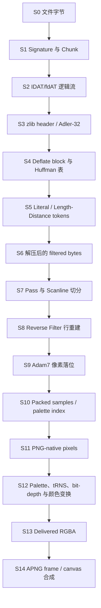
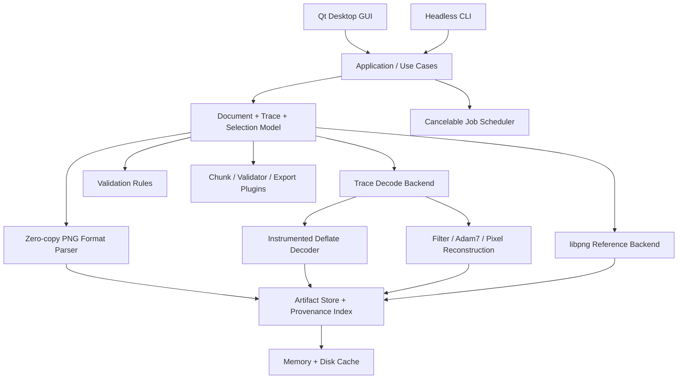

# PNG Analyzer 桌面软件架构设计 v0.1

> 定位：面向 PNG 格式开发者、编解码器工程师、安全研究者和教学用户的高性能桌面分析器。它不是普通的 Chunk 查看器，而是能够把“源文件中的位”一路追踪到“最终显示像素”的可回放解码工作台。

## 1. 结论与核心设计决策

建议采用 **C++20 + Qt 6 + CMake** 构建跨平台桌面应用，将系统分成两条互相校验的解码路径：

1. **Reference Backend（参考后端）**：使用生产版 libpng + zlib，负责可靠解码、最终图像和差分基准。
2. **Trace Backend（可观测后端）**：使用项目自己的零拷贝 Chunk 解析器、zlib 包装层、可插桩 Deflate 解码器、反滤波与 Adam7 模块，产生每个阶段的细粒度状态和来源映射。

不建议把所有功能直接塞进 libpng，也不建议一开始就长期维护 libpng 私有源码分支。libpng 的公开 API 很适合得到头信息、Chunk 语义、行回调和最终像素，但无法完整暴露 Chunk 文件偏移、过滤前字节、Huffman 树、literal/length-distance token 等内部状态；而且从 libpng 1.5 起，应用不能直接访问 `png_struct` 与 `png_info` 私有字段。因此，“libpng 做正确性基准，Trace Backend 做透明分析”是风险最低、扩展性最好的方案。

产品交互借鉴 VQ Analyzer 的不是外观，而是四项设计哲学：

- 按分析尺度分层：流/文件 → 单元/Chunk → 解码阶段 → 行/像素。
- 所有窗口共享同一个 Selection：选择 Chunk、Deflate block、scanline 或 pixel 时，其他面板同步定位。
- 图形、数值、原始字节和标准条款互相联动。
- 把 Compare、First Difference、Statistics 作为一等能力，而不是后期附加工具。

VQ Analyzer 官方把能力分为 Bitstream、Frame、Block、Syntax、Debug、Statistics；这些概念可以分别映射为 PNG Analyzer 的 File/Chunk、Decode Stage、Scanline/Pixel、Field/Spec、Compare、Statistics。[VQ Analyzer 官方功能页](https://vicuesoft.com/vq-analyzer/)

## 2. 产品分析层级

PNG Analyzer 的核心层级不是简单的“文件 → Chunk”，而是：

```text
Document
  ├─ PNG signature
  ├─ Chunk sequence
  │   ├─ Critical / ancillary chunk
  │   └─ IDAT/fdAT physical fragments
  ├─ Logical compressed stream
  │   ├─ zlib wrapper
  │   └─ Deflate blocks
  │       ├─ Huffman tables
  │       └─ literal / length-distance tokens
  ├─ Inflated filtered byte stream
  ├─ Pass / scanline / filter
  ├─ Reconstructed sample / palette index
  ├─ PNG-native pixel
  ├─ Delivered RGBA pixel
  └─ APNG frame / composited canvas
```

这里最重要的是区分三类坐标：

- **Physical file coordinate**：真实文件中的 byte/bit offset。
- **Logical stream coordinate**：把多个 IDAT 的 data 字段串接后，zlib/Deflate 流中的 byte/bit offset。
- **Image coordinate**：pass、scanline、x/y、channel、sample。

软件必须维护三者间的可逆映射。否则只能“查看信息”，不能做到真正的像素级来源追踪。

## 3. 完整解码阶段模型

W3C PNG 第三版给出的概念编码顺序是 pass extraction、scanline serialization、filtering、compression、chunking、datastream construction；分析器的解码路径应反向展开，并把显示变换单独建模。[PNG Specification, Third Edition](https://www.w3.org/TR/png-3/)



阶段定义建议如下：

| Stage | 必须保存或可重建的内容 | 主要查看方式 |
|---|---|---|
| S0 File bytes | 原始字节、文件偏移、hash | Hex/Bit View |
| S1 Chunk | length/type/data/CRC、类型位属性、顺序、错误 | Chunk Tree + Field Inspector |
| S2 Logical stream | IDAT/fdAT 拼接视图、logical↔physical 映射 | Stream Map |
| S3 zlib | CMF/FLG、CM/CINFO、FCHECK/FDICT、Adler-32 | Header Fields + 校验状态 |
| S4 Deflate block | BFINAL/BTYPE、block bit range、dynamic code lengths、Huffman 表 | Block Timeline + Tree/Table |
| S5 Tokens | literal、end-of-block、length/distance、window source | Token Table + LZ Match Overlay |
| S6 Inflated bytes | 完整 filtered byte stream | Byte View + entropy/statistics |
| S7 Scanline | pass、row、filter byte、row byte range | Scanline List |
| S8 Reverse filter | `Raw(x)`、a/b/c、predictor、`Recon(x)` | Formula + byte grid + before/after |
| S9 Adam7 | pass geometry、reduced image、目标 x/y | Pass Map + progressive preview |
| S10 Samples | 1/2/4-bit unpack、8/16-bit sample、channel | Sample Grid |
| S11 Native pixels | 灰度/RGB/index/alpha 的规范原生值 | Pixel Inspector |
| S12 Transforms | PLTE/tRNS、sBIT、gamma/ICC/cICP、背景合成等 | Transform Graph |
| S13 Delivered | 最终显示格式，例如 RGBA8/RGBA16 | Image View |
| S14 APNG | fcTL/fdAT、dispose/blend、frame buffer、canvas | Animation Timeline |

注意：PNG 第三版已经正式包含 APNG 的 `acTL`、`fcTL`、`fdAT`，所以底层数据模型应从第一天支持“静态图或多帧图”，即使 MVP 暂时只完成静态 PNG。[PNG 3: APNG](https://www.w3.org/TR/png-3/#apng-frame-based-animation)

## 4. GUI 信息架构

### 4.1 主窗口布局

采用 IDE/码流分析器式可停靠布局，默认工作区分为五个区域：

| 区域 | 默认内容 | 作用 |
|---|---|---|
| Top Toolbar | Open、工作区、Fast/Deep、stage scrubber、搜索、Compare | 全局动作和当前分析上下文 |
| Left Navigator | Overview、Chunks、Compression、Scanlines、Pixels、Animation、Validation、Statistics | 按分析对象分类，而不是按实现模块分类 |
| Center Workspace | Structure、Pipeline、Image、Compare、Statistics tabs | 主要图形工作区 |
| Right Inspector | Selection Info、Fields、Formula、Provenance、Spec | 当前选择的语义解释 |
| Bottom Details | Raw Bytes、Bit View、Tokens、Events、Warnings | 低层数据和诊断 |

所有面板应可停靠、隐藏、拆分和保存 Workspace。建议内置四套工作区：

- **Inspect**：Chunk Tree + Image + Fields + Raw Bytes。
- **Decode**：Pipeline + Scanline + Formula + Provenance。
- **Compression**：Block Timeline + Huffman + Tokens + LZ Window。
- **Compare**：A/B 双视图 + First Difference + Delta + 同步 Selection。

### 4.2 左侧 Navigator 的推荐分类

1. **Overview**：尺寸、color type、bit depth、interlace、文件大小、压缩率、错误摘要。
2. **Structure**：Signature、Chunk Tree、APNG Frame Tree、unknown/private chunks。
3. **Compression**：Logical IDAT Stream、zlib、Deflate Blocks、Huffman、Tokens、LZ Window。
4. **Reconstruction**：Passes、Scanlines、Filters、Unfilter、Samples。
5. **Image**：Native Pixels、Palette/Alpha、Color Management、Delivered Image、APNG Canvas。
6. **Validation**：结构、CRC、Adler、规范一致性、安全限制。
7. **Statistics**：Chunk 占比、block 类型、token/length/distance 分布、filter 分布、逐行压缩贡献。

这比把所有功能做成同级 tab 更可扩展，也保持了 VQ Analyzer“按观察尺度和任务分类”的思想。

### 4.3 关键交互

#### 全局 Selection 同步

一次选择应能携带以下任意组合：

```cpp
Selection {
  node_id;
  physical_span;
  logical_bit_span;
  frame_index;
  pass_index;
  row_index;
  x, y, channel;
  stage_id;
}
```

典型交互：

- 点击一个 pixel：显示其 native/delivered 值、所在 pass/scanline、反滤波公式、对应 inflated bytes、产生这些字节的 Deflate tokens，最后高亮源文件 bit range。
- 点击一个 Deflate match：显示 distance 指向的 32 KiB window 区域，并高亮它最终影响的 scanline/pixel 范围。
- 点击一个 Chunk：Hex View 高亮完整 Chunk；Inspector 显示字段、CRC 计算范围、规范条款和顺序约束。
- 拖动 Stage Scrubber：同一空间位置在 Filtered、Reconstructed、Native、Delivered 等阶段间切换。

#### Compare / First Difference

支持两种比较：

- **File A vs File B**：同步 Chunk、stage、row、pixel；比较语义，而不是只比较文件 offset。
- **Trace Backend vs libpng Backend**：自动寻找第一个分歧阶段，从最终 pixel 逐级回溯到行、token 或 bit。

差异类型至少包括：结构差异、字段差异、压缩表示差异、重建数据差异、显示变换差异。两个 PNG 即使最终像素相同，也可能有完全不同的 Chunk、filter 和 Deflate 表示，GUI 必须能表达“bitstream different, image equivalent”。

#### 标准关联

Field Inspector 中每个已知字段包含：

- 名称、原始值、十六进制/十进制/二进制。
- 条件和合法范围。
- 当前值的解释。
- 相关 warning/error。
- W3C PNG 3、RFC 1950、RFC 1951 的 section URL。

不要在仓库中复制大段规范正文；保存短摘要和深链接，避免内容过期与版权/维护问题。

## 5. 软件总体架构



### 5.1 层次职责

#### Domain Core

纯 C++，不得依赖 Qt。包含：

- `PngDocument`、`ChunkRecord`、`FrameRecord`。
- `VirtualByteStream` 与 logical/physical offset mapping。
- `StageGraph`、`StageArtifact`、`TraceEvent`、`SourceSpan`。
- `Selection` 与 provenance query。
- 错误、告警、标准引用的数据类型。

Core 无 GUI 依赖，确保 CLI、测试、未来 Python bindings 和服务器模式复用。

#### Application Layer

实现 `OpenDocument`、`AnalyzeStage`、`TraceSelection`、`CompareDocuments`、`ExportArtifact` 等 use case；负责取消、优先级、后台任务和进度，不直接绘制 UI。

#### Backend Layer

- `LibpngBackend`：生产级参考解码。
- `TraceBackend`：可观测解码。
- 后续可增加 `spng` 或硬件解码器 backend 做差分验证。

统一接口示意：

```cpp
class IDecodeBackend {
public:
  virtual DecodeCapabilities capabilities() const = 0;
  virtual DecodeResult decode(const DecodeRequest&, ITraceSink&) = 0;
  virtual ~IDecodeBackend() = default;
};
```

`DecodeCapabilities` 必须明确 backend 能观察到的 stage，不能用空数据假装支持。

#### Infrastructure

- memory-mapped file / windowed mapping。
- Artifact cache、临时文件、hash、JSON/SQLite session。
- thread pool、logging、crash report、settings。
- GPU image tile/overlay upload。

## 6. 核心数据模型

### 6.1 SourceSpan 与映射

```cpp
struct BitSpan {
  uint64_t byte_offset;
  uint8_t  bit_offset;
  uint64_t bit_length;
};

struct StreamSpan {
  StreamId stream;
  uint64_t logical_bit_offset;
  uint64_t bit_length;
};
```

`VirtualByteStream` 只拼接 IDAT data 字段，不复制实际数据，并保存 segment table：

```text
logical [0, 8192)      -> file IDAT#0 data [offset A, A+8192)
logical [8192, 12000)  -> file IDAT#1 data [offset B, B+3808)
```

W3C 明确指出 IDAT 边界可以落在 zlib 流任意位置，与 Deflate block、scanline 都没有必然对应关系，因此这个映射层是架构必需品。[PNG 3 §10.2](https://www.w3.org/TR/png-3/#compression-of-the-sequence-of-filtered-scanlines)

### 6.2 SemanticNode

所有可选择对象统一为节点：

```cpp
struct SemanticNode {
  NodeId id;
  NodeKind kind;
  NodeId parent;
  SmallVector<NodeId> children;
  SmallVector<SourceSpan> source_spans;
  PropertyBag fields;
  Optional<SpecRef> spec;
  Severity severity;
};
```

Chunk、zlib header、Deflate block、Huffman code、token、scanline、pixel 都只是不同 `NodeKind`，GUI 不需要了解各 decoder 的私有对象。

### 6.3 StageArtifact

```cpp
struct StageArtifact {
  ArtifactId id;
  StageId stage;
  CoordinateSpace space;
  PixelOrByteFormat format;
  Extent extent;
  StorageHandle storage;
  ProvenanceIndex provenance;
};
```

Artifact 不要求永久驻留内存。`StorageHandle` 可以指向 mmap slice、small inline data、compressed memory block、tile cache 或临时磁盘对象。

### 6.4 TraceEvent

反滤波等算法用事件描述，而不是在 GUI 中重新计算：

```cpp
TraceEvent {
  event_id, stage, operation;
  input_spans[];
  output_spans[];
  parameters;
  formula_id;
  before_values[];
  after_values[];
}
```

这样 GUI 能稳定展示 `Recon(x) = Raw(x) + Paeth(a,b,c) mod 256`，也能适配 16-bit、packed sample 和后续插件。

## 7. libpng 集成策略

### 7.1 使用 libpng 的部分

建议基于当时最新稳定版 pin 住精确 tag；截至 2026-08，公开稳定版为 **libpng 1.6.58**。不要跟随 `libpng18` 开发分支作为默认生产依赖。[libpng 官方主页](https://www.libpng.org/pub/png/libpng.html)

可利用的公开接口：

- `png_set_read_fn()`：从项目的虚拟/受控输入读取。
- `png_set_progressive_read_fn()` + `png_process_data()`：获得 info、row、end 回调，支持流式处理和取消。
- `png_set_read_user_chunk_fn()`：处理 unknown/private chunks。
- `png_set_crc_action()`：配置 critical/ancillary CRC 与 IDAT Adler 错误行为。
- `png_set_read_status_fn()`：行级进度。
- `png_set_read_user_transform_fn()`：观察或增加最终行变换，但它不是“过滤前数据”钩子。
- `png_set_user_limits()`、chunk cache/malloc limits：安全边界。

这些 API 的语义可在 [libpng manual](https://libpng.org/pub/png/libpng-manual.txt) 中查到。

### 7.2 libpng 不能单独满足的部分

libpng 的公开回调没有稳定地暴露：

- 每个已知 Chunk 的完整 raw offset/span。
- IDAT 拼接后的 logical bit mapping。
- zlib/Deflate block header、Huffman table、每个 token。
- inflate 后但 reverse filter 前的完整行状态。
- reverse filter 公式中的 a/b/c 与逐字节中间值。
- 任意 stage 的可序列化随机访问 checkpoint。

libpng 源码中的行读取顺序确实是 `read IDAT → reverse filter → read transformations → interlace combine`，但这属于内部实现，且私有结构不是稳定 API。[libpng `pngread.c`](https://github.com/pnggroup/libpng/blob/libpng18/pngread.c)

因此建议：

- 不修改系统 libpng。
- `LibpngBackend` 只使用公开 API。
- `TraceBackend` 自己实现需要观察的规范路径。
- 两个 backend 对 native rows 与 delivered pixels 做逐行 hash/逐像素比对。
- 如果未来确实需要展示“libpng 内部实现状态”，维护一个**可选的、版本锁定的 instrumented-libpng backend**，而不是让整个产品依赖私有字段。

## 8. Deflate Trace 设计

### 8.1 两级模式

#### Fast Trace

使用标准 zlib `inflate()`：

- `Z_BLOCK` 可停在 block boundary。
- `Z_TREES` 可停在 block header 结束处。
- `data_type` 可帮助计算当前 bit position。
- `inflateCopy()` 可创建随机访问 checkpoint。

这些能力足以快速建立 block index，但不能获得全部 Huffman symbol 和 LZ token。[zlib manual](https://zlib.net/manual.html)

#### Deep Trace

对用户选择的 block/scanline/region 按需重放：

- 解析 zlib wrapper。
- 逐 bit 解析 stored/fixed/dynamic Deflate blocks。
- 发出 code-length、Huffman、literal、length、distance、copy 事件。
- 保存 sliding window 来源和 output range。
- 输出必须逐字节等于 zlib 的输出。

初期可改造 zlib 官方 `contrib/puff` 的简单 Deflate decoder，加入 `ITraceSink`，同时保留 zlib license attribution；长期可把它演化为项目自己的、安全受限的只读 Trace Decoder。zlib FAQ 本身把 `contrib/puff` 指向为简单 Deflate 解码参考。[zlib FAQ](https://github.com/madler/zlib/blob/develop/FAQ)

不要直接给高性能主路径中的 `inflate_fast()` 到处插 GUI 事件；这会严重破坏性能、增加维护成本。正确方式是：Fast 模式建立索引，Deep 模式仅重放选择范围。

### 8.2 Checkpoint

Checkpoint 至少包含：

- logical input bit position。
- output byte position。
- 32 KiB sliding window 或可恢复 window snapshot。
- 当前 Huffman tables/block state。
- 当前 scanline/pass 与 previous reconstructed row。

默认在 block boundary 和每 N MiB inflated output 建 checkpoint；用户进入某行时，从最近 checkpoint 重放。checkpoint 间隔由内存预算动态调整。

## 9. 高性能设计

### 9.1 默认只做索引，不保存所有中间态

完整保存每个 byte 在每个 stage 的副本会造成数倍到数十倍内存膨胀。采用三档 trace policy：

- **Index**：保存节点、offset、hash、统计和 checkpoint。
- **Rows**：保存 selected/pass-nearby scanlines 的 before/after。
- **Deep**：保存选定 block/row/pixel 的逐事件 trace。

用户切换 stage 时优先从 cache 读取；缺失 artifact 后台重放生成。

### 9.2 I/O 与内存

- 普通文件使用 read-only memory mapping；超大文件使用 windowed mapping。
- Chunk parser 只保存 span，不复制 data。
- IDAT 使用 scatter/gather `VirtualByteStream`。
- 图像显示使用 256×256 或 512×512 tiles，只上传视口需要的纹理。
- 16-bit native image 保持无损；显示预览另建 RGBA8 tile，不覆盖原始数据。
- Artifact cache 使用全局内存预算和 LRU；大对象可压缩后写入 OS cache 目录。
- cache key 使用文件 hash + analyzer version + backend version + decode options。

### 9.3 并行边界

可以并行：

- Chunk CRC、部分 ancillary chunk 解析/解压。
- libpng reference decode 与 trace decode。
- tile 转换、overlay、统计、导出。
- 多文件比较和测试。

不能假设可任意并行：

- 单个 Deflate 流依赖前面的 bit state 和 32 KiB window。
- PNG reverse filter 通常依赖上一条 reconstructed scanline。
- Adam7 每个 pass 内仍按该 pass 的 scanline 顺序重建。

因此主路径是“顺序解码 + 多消费者并行”，随机访问依靠 checkpoint/replay，而不是把一个流硬切成无状态块。

### 9.4 可取消任务

打开大文件、Deep Trace、统计和比较全部必须是 cooperative cancellation。每个 job 具有：

- generation id，避免旧结果覆盖新 Selection。
- priority：当前像素/行 > 当前视口 > 后台全文件统计。
- progress unit：bytes、rows、blocks 或 frames。
- memory budget reservation。

## 10. Validation 与安全

PNG 文件来自不可信输入，GUI 不能因“只是分析器”而降低安全标准。

### 10.1 规则分层

- **Structural**：signature、Chunk length、IHDR/IEND 唯一性、IDAT 连续性、Chunk order。
- **Integrity**：CRC-32、Adler-32。
- **Semantic**：color type × bit depth、PLTE/tRNS 合法性、APNG sequence/dispose/blend。
- **Decode**：Deflate/Huffman、filter type、scanline size、palette index。
- **Resource**：dimensions、rowbytes、inflated size、text/profile size、frame count、CPU budget。

每个规则返回 `rule_id + severity + source spans + spec ref + suggested action`。

### 10.2 防护

- checked arithmetic，所有 width×height×channels、rowbytes、offset+length 必须防溢出。
- 配置最大 dimensions、pixels、inflated bytes、Chunk allocation、metadata size、APNG frames。
- 解析与 UI 分线程；未来可增加 sandboxed worker process。
- CI 中启用 ASan/UBSan，Linux fuzz target 使用 libFuzzer/AFL++。
- 依赖固定版本并启用 Dependabot/Renovate；libpng 近期版本出现过多次安全修复，更应避免长期锁死旧版。
- 对 malformed file，默认继续建立“尽可能多的结构树”，但不得继续使用不可信长度进行分配。

## 11. 插件架构

建议三类插件：

- `IChunkDecoderPlugin`：私有/扩展 Chunk 的字段解析、验证、视图。
- `IValidatorPlugin`：公司内部规范或实验规则。
- `IExporterPlugin`：JSON、CSV、raw stage、image、HTML report。

第一版内部模块使用静态注册；公开 SDK 成熟后采用版本化 C ABI，避免直接暴露 C++ STL/Qt ABI。插件输出统一的 `SemanticNode`、`PropertyBag`、`ValidationIssue` 和声明式表格/图层，不允许任意操纵主窗口。

第三方插件默认不可信；后续可通过 out-of-process plugin host 隔离崩溃和内存破坏。

## 12. 推荐技术栈

| 层 | 建议 | 理由 |
|---|---|---|
| Language | C++20 | 适合 codec、零拷贝、SIMD、跨平台原生性能 |
| Desktop UI | Qt 6 Widgets | 成熟的 dock、model/view、跨平台、无障碍、国际化 |
| Image canvas | Qt viewport + tiled textures；必要时单独 GPU backend | 先保证正确与可维护，再优化巨大图像 |
| Build | CMake + CMakePresets | IDE/CI/平台统一 |
| Dependencies | vcpkg manifest 或锁定 FetchContent SHA | 可复现构建 |
| PNG oracle | libpng 1.6 stable | 官方参考库 |
| Compression | zlib stable + instrumented `puff`/trace decoder | 快速路径与深度路径分离 |
| Session/cache | JSON settings + SQLite index（需要时） | 易调试且支持大规模索引 |
| Tests | Catch2/GoogleTest + fuzzers | 单元、golden、差分、模糊测试 |
| Packaging | CPack；Windows MSIX/zip、macOS app/dmg、Linux AppImage/Flatpak | GitHub Releases 友好 |

Qt 许可需要在发布设计时明确：若项目采用 Apache-2.0/MIT，可动态链接 LGPL 版本 Qt，并遵守 Qt LGPL 的重新链接、许可文本等要求；也可以让发行包使用者自行安装 Qt。此项应在正式发布前做一次独立许可审查。

## 13. GitHub 仓库结构

```text
png-analyzer/
├─ apps/
│  ├─ png-analyzer-gui/
│  └─ pnga-cli/
├─ libs/
│  ├─ core/
│  ├─ io/
│  ├─ png-format/
│  ├─ trace-model/
│  ├─ png-reconstruction/
│  ├─ deflate-trace/
│  ├─ backend-libpng/
│  ├─ validation/
│  ├─ compare/
│  ├─ statistics/
│  ├─ rendering/
│  └─ plugin-sdk/
├─ plugins/
│  ├─ chunks-standard/
│  └─ exporters/
├─ tests/
│  ├─ unit/
│  ├─ conformance/
│  ├─ differential/
│  ├─ golden-traces/
│  └─ fuzz/
├─ samples/
├─ docs/
│  ├─ architecture/
│  ├─ formats/
│  ├─ plugin-sdk/
│  └─ adr/
├─ packaging/
├─ cmake/
├─ .github/
│  ├─ workflows/
│  ├─ ISSUE_TEMPLATE/
│  └─ PULL_REQUEST_TEMPLATE.md
├─ CMakeLists.txt
├─ CMakePresets.json
├─ vcpkg.json
├─ LICENSE
├─ SECURITY.md
├─ CONTRIBUTING.md
└─ README.md
```

CLI 不是附属功能。`pnga-cli` 与 GUI 使用同一 core，可用于 CI、批量统计、fuzz 重现、golden trace 和 bug report：

```text
pnga inspect sample.png --json
pnga validate sample.png
pnga trace sample.png --stage deflate --block 12
pnga trace sample.png --pixel 320,180 --provenance
pnga compare a.png b.png --first-difference
```

## 14. 测试策略

1. **Parser unit tests**：所有 Chunk 类型、边界长度、顺序与 CRC。
2. **Algorithm unit tests**：五类 filter、packed samples、Adam7 每个 pass、16-bit big-endian samples。
3. **Deflate golden tests**：stored/fixed/dynamic、极端 Huffman、跨 32 KiB window、跨 IDAT 边界。
4. **Differential tests**：Trace Backend vs libpng，native row 和 delivered RGBA 均比较。
5. **Conformance corpus**：复用 libpng 仓库中的 pngsuite/testpngs，并维护项目自己的 malformed corpus。[libpng repository](https://github.com/pnggroup/libpng)
6. **Fuzzing**：Chunk parser、zlib wrapper、Deflate trace、filter/Adam7、APNG state machine 分别建 target。
7. **GUI tests**：Selection 同步、取消/重入、workspace、A/B compare、DPI 与主题。
8. **Performance regression**：打开时间、首次预览、完整索引、Deep Trace latency、peak RSS、tile FPS。

每个 GitHub bug 都尽量提交最小 PNG、CLI 重现命令和预期/实际 trace，避免只保存 GUI 截图。

## 15. 路线图

以下以 1–2 名熟悉 C++/codec 的开发者为粗略估算。

### Phase 0：Architecture Spike（2–3 周）

- CMake/Qt/CI 骨架。
- mmap Chunk parser、VirtualByteStream。
- libpng progressive backend。
- 最小 Chunk Tree、Hex View、Image View。
- 验证 logical↔physical↔pixel selection 数据模型。

退出条件：点击 IDAT/row/pixel 可以在核心模型中稳定互相定位。

### Phase 1：可用 MVP（6–8 周）

- 完整标准 Chunk fields 与顺序/CRC 验证。
- static PNG 全 color type/bit depth/Adam7。
- Filtered、Unfiltered、Native、Delivered 四个可视阶段。
- Scanline/Pixel inspector、公式、standard link。
- CLI inspect/validate/export。
- Fast/Deep 任务与 cache 框架。

退出条件：支持常见和边界 static PNG，Trace Backend 与 libpng corpus 差分一致。

### Phase 2：Compression Workbench（8–12 周）

- zlib header/trailer、Deflate block index。
- dynamic Huffman、token、LZ window trace。
- checkpoint/replay 和 pixel→token provenance。
- compression statistics 与 block/token 可视化。

退出条件：任意 pixel 可回溯到 reconstructed bytes、Deflate token 和源 bit span。

### Phase 3：Debug 与开源质量（6–8 周）

- A/B synchronized compare、First Difference。
- report/export、workspace、plugin SDK v1。
- fuzz/sanitizers、性能基准、跨平台安装包。
- GitHub 文档、贡献指南、good-first-issue。

### Phase 4：PNG 3 / APNG 与高级能力（6–10 周）

- acTL/fcTL/fdAT、frame/output buffer/canvas。
- blend/dispose 逐阶段查看和 animation compare。
- color management/cICP/mDCV 深度视图。
- optional sandbox worker、hardware/SIMD experiments。

## 16. MVP 取舍与成功指标

### MVP 必须有

- Chunk Tree、Field/Spec、Hex/Bit、CRC/validation。
- IDAT logical stream map。
- static PNG 全基本格式与 Adam7。
- Filtered → Unfiltered → Native → Delivered 的 stage 切换。
- 行/像素 Selection 同步与 provenance。
- libpng differential verification。
- headless CLI。

### MVP 暂缓

- 完整 APNG 播放器。
- 所有颜色管理策略的高精度显示模拟。
- 第三方二进制插件 ABI。
- 远程文件、团队协作、云报告。
- 编码器/Chunk 编辑功能；先把只读分析做稳。

### 建议的量化指标

- 100 MiB PNG：Chunk 索引与 Overview 在 300 ms–1 s 级出现，完整 decode 后台继续。
- 常规 4K PNG：首次预览目标 < 500 ms（发布版、主流桌面 CPU，具体以基准机校准）。
- 任意已索引 scanline 的 Deep Trace：有邻近 checkpoint 时目标 < 100 ms–300 ms。
- 默认内存：不超过 source + final pixels + 有界 cache；不开 Deep 时不保存全量 token event。
- corpus 上 Trace vs libpng 的 native output 逐字节一致。
- malformed input 不崩溃、不无界分配、不阻塞 UI。

这些数值是工程目标，不是对所有输入的保证；在 Phase 0 建立基准机和 corpus 后再冻结。

## 17. Architecture Decision Records（ADR）建议

首批应提交到 `docs/adr/`：

- ADR-0001：C++20 + Qt 6。
- ADR-0002：libpng Reference Backend 与 Trace Backend 双路径。
- ADR-0003：统一 SemanticNode/Selection/Provenance 模型。
- ADR-0004：Fast index + on-demand Deep Trace。
- ADR-0005：mmap + VirtualByteStream，不拼接复制 IDAT。
- ADR-0006：Core 不依赖 Qt，GUI/CLI 共用。
- ADR-0007：先 static PNG，数据模型从第一天兼容 APNG。
- ADR-0008：公开插件使用版本化 C ABI，首版静态注册。

## 18. 最终建议

这个项目最容易犯的错误，是把它做成“漂亮的 pngcheck”。真正形成壁垒的是以下闭环：

**选择任何语义对象 → 看见对应原始 bit → 看见该步公式与输入输出 → 切换相邻解码 stage → 回溯到最终 pixel 或上游 token → 与 libpng/另一个文件同步比较。**

只要 Domain Model、Virtual Stream Mapping、StageArtifact 和 Provenance 四个基础在 Phase 0 设计正确，后续添加 Chunk、APNG、颜色管理和插件都属于纵向扩展；如果这四项缺失，GUI 面板越多，系统越容易退化为互不联动的信息窗口集合。

## 参考资料

- [Portable Network Graphics (PNG) Specification, Third Edition](https://www.w3.org/TR/png-3/)
- [libpng 官方主页](https://www.libpng.org/pub/png/libpng.html)
- [libpng manual](https://libpng.org/pub/png/libpng-manual.txt)
- [libpng GitHub repository](https://github.com/pnggroup/libpng)
- [zlib manual](https://zlib.net/manual.html)
- [zlib GitHub repository](https://github.com/madler/zlib)
- [VQ Analyzer 官方功能页](https://vicuesoft.com/vq-analyzer/)

