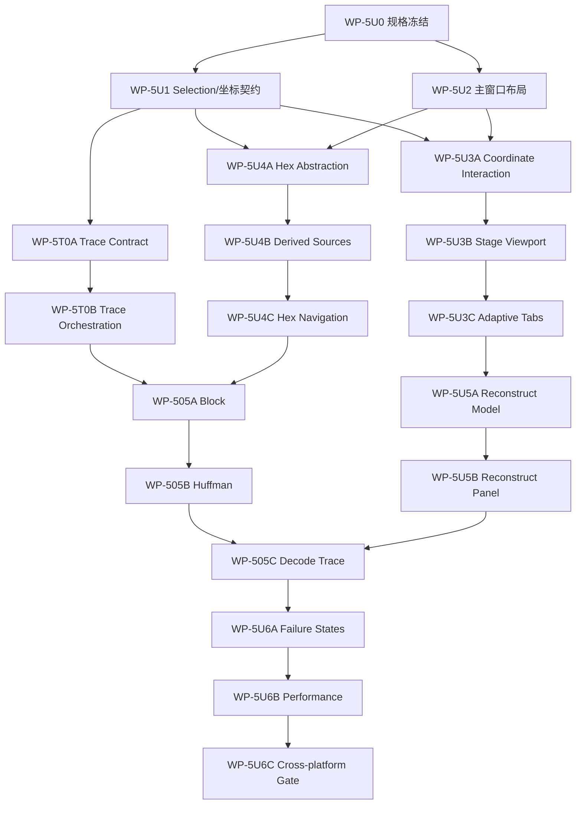

# PNG Analyzer 当前开发进度与后续执行计划（2026-08-22）

> Status: Active execution supplement
> Baseline commit: `d8608a6` (`main`，WP-603D CI runtime evidence 修复完成)
> Parent plan: [PNG Analyzer Agent 可执行开发计划 v0.1](png-analyzer-agent-development-plan-v0.1.md)

## 1. 文档作用与范围

本文件把仓库的实际实现状态与 2026-08-22 确认的 UI 调整合并成下一阶段的可执行计划。它只修订当前状态、未开始工作包和执行顺序，不改变已接受的 ADR、仓库布局、Qt 边界或安全规则。

本轮产品目标收敛为：

> 先完成单文件、单坐标、从最终像素到 scanline、DEFLATE token 和文件位范围的完整分析体验，再扩展比较和动画能力。

明确范围：

- 保留左侧 Chunk List。
- 中央上方改为多阶段 Preview，中央下方为 Hex。
- 右侧顶部为坐标工具栏，右侧主体为坐标驱动的 Inspector 标签页。
- `Compare` 与依赖它的 `First Difference` 暂缓；本轮不显示入口、禁用项或占位标签。
- `Statistics` 不依赖 Compare，保留为 M5 Gate 后的独立范围决策。
- APNG 仍属于 M7；本轮不得实现部分 APNG UI。

## 2. 当前开发进度

### 2.1 实现状态

| 里程碑 | 当前状态 | 已落地范围 | 尚缺 Gate 证据或功能 |
|---|---|---|---|
| M0 工程骨架与契约 | 实现完成 | WP-000、00A、001、002 | 本次未复核三平台 CI 与 ASan |
| M1 文件与 Chunk 垂直切片 | 实现完成 | WP-100～104 | malformed smoke corpus 仍需扩充 |
| M2 统一模型与参考解码 | 实现完成 | WP-200～206 | 快速连续切换文件的完整 GUI 压测仍需 Gate 化 |
| M3 可观测重建流水线 | 实现完成 | WP-300～306 | conformance corpus 与 sanitizer Gate 尚未形成完整证据包 |
| M4 大文件索引与随机访问 | 实现完成 | WP-400～406 | 跨平台机器基线尚未冻结 |
| M5 Deep Deflate Trace | Block/Huffman/Decode Trace Inspector、bounded Trace Gate、WP-5U6A 状态契约、WP-5U6B 性能 Gate 与 WP-5U6C GUI Gate 已实现 | WP-500～504、WP-5U0～WP-5U5B、WP-5T0A～WP-5T0B、WP-505A～WP-505C、bounded Trace Gate、WP-5U6A～WP-5U6C | 三平台原生 CI、正式 fuzz corpus、发布证据仍未完成 |
| M6 Validation、Statistics、发布 | WP-600A～WP-600C、WP-602A、WP-602B、WP-603A～WP-603D、WP-604A～WP-604B、WP-605A～WP-605C 已实现/决策 | Structural/integrity/semantic/decode/resource 规则、Qt-free bounded statistics engine、单一 analysis-engine 聚合入口、WP-602B v1 延后决策、CLI JSON 与 GUI worker 状态整合、固定 fuzz replay 的 ASan/UBSan 门禁、可选 libFuzzer harness/runner、Ubuntu CI coverage runtime evidence、生成式性能 corpus/runner、机器记录 schema、固定阈值 gate、portable package smoke、用户/开发者/Trace/bug report 文档、RC audit runner | 跨平台性能基线与原生安装器 |
| M7 APNG | 未开始 | 模型预留 frame 维度 | 维持 post-v1 |

截至当前提交，M0～M4、M5 的 WP-500～504、WP-5U0～WP-5U6C、WP-5T0A～WP-5T0B 及 M6 的 WP-600A～WP-600C、WP-602A～WP-602B、WP-603A～WP-603D、WP-604A～WP-604B、WP-605A～WP-605C 已有实现或决策提交。这里的“实现完成”不等于里程碑 Gate 已关闭；Gate 仍要求 coverage-guided runtime、跨平台性能、原生安装器和人工交互证据。

### 2.2 2026-08-22 本地核验

已执行：

```text
cmake --build --preset dev -j
ctest --test-dir build/dev --output-on-failure
python3 scripts/verify_repository_layout.py
python3 scripts/verify_dependencies.py
python3 scripts/run_gui_gate.py
python3 scripts/run_coverage_fuzz.py --seconds 1
git status --short --branch
```

结果：

- 当前提交完整 dev 构建通过，Qt 6.11.1 GUI target 已启用；`coverage-fuzz` preset 在当前主机因 Apple toolchain 缺少 libFuzzer runtime 无法配置，runner 明确记录 `NOT_CONFIGURED`。
- dev 与 ASan/UBSan 各有 35/35 个 CTest 测试入口通过（GUI 运行使用 `QT_QPA_PLATFORM=offscreen`）；新增的 150%/200% DPI GUI 注册均通过，专门 `scripts/run_gui_gate.py` 生成当前主机和三档 Qt scale evidence。测试覆盖 core、parser、reconstruction、Deflate、differential、CLI、fuzz smoke、性能 corpus runner、Qt-free bounded WP-602A Statistics Engine 与 GUI 测试；并包含 Block/Huffman/Decode Trace Inspector、统一 binding、WP-5U6A 状态机、WP-5U6B 性能回归、WP-5U6C 跨平台 GUI Gate、WP-600A/600B 规则边界测试、WP-600C CLI/GUI 报告整合、WP-603A/603B fuzz smoke、WP-603C sanitizer replay gate、WP-604A performance record 与 WP-604B threshold gate。
- 仓库布局检查：0 failure、0 warning。
- 依赖静态检查：0 failure、0 warning。
- 本次核验覆盖当前 `main` 的 `8287c40`；布局与依赖静态审计均为 0 failure、0 warning。GUI evidence 记录 macOS arm64 / Qt 6.11.1 的默认、150% 和 200% scale 运行；WP-603D runner 已执行并记录当前 Apple toolchain 缺少 libFuzzer runtime（`NOT_CONFIGURED`）。原生 Windows/Linux 窗口系统、屏幕阅读器和原生安装器仍未由本机证据覆盖。

正式 coverage-guided fuzz 已在 Ubuntu CI run `32610155310` 通过；本机 Apple toolchain 仍为 `NOT_CONFIGURED`。跨平台 performance threshold、原生 DMG/MSIX/AppImage/Flatpak 或 Qt framework deployment 仍未声称通过。dev 与 ASan/UBSan 全量、WP-603C 定向 replay、WP-604A runner、WP-604B threshold gate、WP-605A portable archive smoke、WP-605B 文档自检、WP-605C RC audit 与 GUI performance scenario 均已通过；原生安装器和发布证据仍属后续 Gate。

### 2.3 当前 UI 与目标之间的主要差距

当前界面已经能显示 Chunk、文件 Hex、Delivered Image 和基础 Stage Inspector；WP-5U0～WP-5U6C 已按冻结契约落地，主要剩余差距是：

- Hex 多数据源、坐标交互、阶段 viewport、自适应标签、Reconstruct view model、Inspector 首版与本地跨平台/性能 Gate 已实现；原生三平台窗口系统证据仍待 CI/发布环境。
- WP-500～504 已提供 wrapper、block、Huffman、token、LZ source 和 pixel provenance 基础；WP-5T0A～WP-5T0B 已形成受预算、可取消、generation 安全的聚合查询链路；WP-505A～WP-505C 与 bounded Trace Gate 已将 block 关联范围、码表构建顺序、token 算术、受限原始 literal 路径和导航上下文投影到 Qt-free/UI。
- 当前 `StageSet` 会物化完整阶段数据；后续 UI Gate 不能据此扩展为“每个阶段都长期持有一张全尺寸 QImage”。
- 测试 corpus 目前以生成式单元 fixture 为主，尚未形成 UI 验收矩阵与 Trace Gate 所需的受控样本集合。

## 3. UI 状态与架构映射

UI 重构必须继续遵守 ADR-0003、0004、0005、0006：Qt 不进入 `libs/`，GUI 不重新解析 PNG/DEFLATE，IDAT 不全量拼接，Deep Trace 只按需执行。

不要把所有界面状态都塞进持久领域 `Selection`。建议冻结以下边界：

| 状态 | 所属层 | 规则 |
|---|---|---|
| 锁定像素、channel/sample、stage、节点、逻辑/物理 spans | `trace-model::Selection` | 跨面板共享；支持一对多和不连续 spans |
| Hover 坐标与简要值 | Preview widget 本地瞬时状态 | 不发布 Deep Trace，不驱动 Hex 或 Inspector 重算 |
| 当前 Chunk | 共享 Selection 的 node/physical spans 维度 | 与像素维度可同时存在，不清空不理解的维度 |
| Hex 数据源与“Hex 跟随像素” | Qt view state | 决定 Hex 由像素还是 Chunk 驱动，不改变领域事实 |
| DEC / HEX 显示基数 | Qt 用户偏好 | 全局一致并持久化；位字段仍以二进制为主 |
| Workspace 布局 | Qt settings | 保存 dock/splitter 状态，可恢复默认布局 |

如果像素、channel 与 16-bit 高低字节无法由现有 `ImageCoordinate` 无歧义表达，必须在专门工作包中扩展公开模型并同步接口文档；不得在某个 widget 内维护第二套私有坐标语义。

## 4. 新增与重写的 M5 UI 工作包

### WP-5U0：UI 规格、状态矩阵与验收样本冻结

属性：P0，S，docs-only。

依赖：WP-306、WP-406、WP-504。

目标：在编码前冻结控件级布局、语义、状态和验收规则，消除“同一标签表示不同阶段”或“像素与字节关系含糊”的实现风险。

交付物：

1. 一份低保真控件布局，明确左 Chunk、中央 Preview/Hex、右坐标工具栏/Inspector。
2. 默认尺寸、最小尺寸、缩窗退化、dock/splitter、浮动、持久化和 `Reset Layout` 规则。
3. `Selection` 合并、hover/locked coordinate、Chunk 与 Hex 驱动权的完整状态转移表。
4. Preview 标签语义与自适应矩阵，覆盖 color type 0/2/3/4/6、bit depth 1/2/4/8/16、Adam7、PLTE/tRNS/alpha。
5. Filtered 数值的显示语义：原始 `0..255`、有符号残差或双模式；必须包含图例。
6. DEC/HEX 全局切换范围；BFINAL、BTYPE、Huffman code、extra bits 等仍优先显示二进制。
7. loading / not applicable / replaying / partial / error / cancelled 的文案和可恢复行为。
8. UI 验收样本矩阵：1-bit grayscale、4-bit indexed+PLTE/tRNS、RGB8、RGBA16、五种 Filter、Adam7、Stored/Fixed/Dynamic、多 IDAT 跨 block、截断/损坏、大图。
9. 初始性能预算与测量方法，至少覆盖 hover、锁定选择、按需 replay、内存峰值和 UI 线程阻塞。

非目标：生产代码、视觉主题精修、Compare、First Difference、APNG。

验收：所有状态和标签均能对应到现有或明确计划中的 Qt-free 数据接口；没有要求 GUI 解析或重算 PNG/DEFLATE；项目负责人确认规格后才可开始后续代码工作包。

### WP-5U1：统一 Selection 与坐标查询契约

属性：P0，M。

依赖：WP-5U0。

目标：让一个锁定坐标可以稳定展开为 pixel、channel/sample、pass/scanline/byte、stage、Chunk、logical span 和多个 physical/bit spans，同时保持 hover 与显示偏好为 UI 状态。

允许修改：

- `libs/trace-model/**`
- `libs/analysis-engine/**`
- `ui/qt/**`
- `tests/unit/trace-model/**`
- `tests/unit/analysis-engine/**`
- `tests/gui/**`
- 相关接口文档；若公开选择语义变化，更新 ADR-0004 的说明

实施重点：

1. 冻结 `ImageCoordinate` 对 channel、sample byte、packed sample 和 Adam7 pass 的表达规则。
2. 定义 Qt 侧 `HexSource`、`hexFollowPixel`、numeric base 和 locked/hover 状态，不复制领域模型。
3. 明确 Chunk 与像素选择合并时各维度的保留规则，避免任一面板清空自己不理解的选择。
4. 为坐标越界、stage 不适用、一个对象对应多个 spans 和旧 generation 结果提供稳定状态。
5. 提供面向 UI 的只读坐标摘要查询；GUI 不直接拼装 reconstruction/trace 模块。

必测：Selection 序列化往返、合并幂等、packed/16-bit/Adam7 坐标、多个不连续 spans、generation 丢弃、100 次交替选择无回环。

### TRACE-0 工作流：像素到 DEFLATE 的聚合查询模型

属性：P0，Qt-free。

依赖：WP-500～504、WP-5U1。

目标：把已实现的 wrapper、block index、Huffman tables、tokens、LZ source 和 provenance 组合成 GUI 可直接消费的不可变查询结果。

查询结果至少包含：

- 选中 sample/byte 对应的 Associated Block(s)，含 BFINAL、BTYPE、输入 bit 范围、输出 byte 范围和跨越的 IDAT spans。
- 关联 token 列表及当前字节在 token output 中的位置。
- Literal 的 symbol/bit path，或 Match 的 length/distance/base/extra bits、source range、overlap 语义。
- token 所使用的 Huffman table 及当前表项；Dynamic block 关联 Code Length、Literal/Length、Distance 三类表。
- logical Deflate bit → Virtual IDAT → 多个 physical file spans 的映射。
- `not indexed / replaying / ready / partial / error / cancelled` 状态。

约束：按 block/selection replay；不得默认保存全文件 token trace；任务可取消并在发布前检查 document generation；错误文件可以返回已验证的部分结果。

执行工作包：

- `WP-5T0A Trace Query Contract`（M）：定义 block、token、table、bit span、match source、partial/error 状态和稳定序列化；不启动线程。
- `WP-5T0B On-demand Trace Orchestration`（M）：从当前 selection 执行受预算、可取消的 replay，组合 Virtual IDAT 映射并检查 document generation。

必测：Stored/Fixed/Dynamic、literal、普通 match、重叠 match、32 KiB wrap、跨 block、跨 IDAT、一个像素关联多个 token/block、截断或非法 Huffman 数据。

### WP-5U2：主窗口布局重构与 Workspace 状态

属性：P0，M。

依赖：WP-5U0。

目标：完成新信息架构的空壳与状态持久化，不在此工作包实现新的解码能力。

默认布局：

- 左：保留 Chunk List dock。
- 中央：垂直 splitter，上方 Preview、下方 Hex，初始比例约 `60% / 40%`。
- 右上：X/Y 手动输入、锁定状态、DEC/HEX、`Hex 跟随像素`。
- 右下：Inspector tabs，首个标签固定为 `Reconstruct`。

实施重点：dock 可隐藏/拖动/浮动；窗口缩小时有明确退化；保存 dock/splitter/tab 状态；提供 `View → Reset Layout`；不同 DPI 和系统字体不截断；本轮不显示 Compare/First Difference 入口或占位。

必测：首次默认布局、状态保存/恢复、损坏 settings 回退、Reset Layout、最小窗口、150%/200% DPI、键盘焦点顺序。

### UI-3 工作流：多阶段 Preview、hover 与锁定坐标

属性：P0。

起始依赖：WP-5U1、WP-5U2。

目标：把中央上方从单一 Delivered Image 扩展为坐标一致的多阶段观察区。

固定基础标签顺序：

1. `Image`：最终 Delivered Image。
2. `Pixels`：文件原生 sample/pixel 数值，不是第二张最终图像。
3. `Filter Map`：每条 scanline 的 Filter Type。
4. `Filtered`：DEFLATE 输出的过滤字节。
5. `Defiltered`：逆过滤后的 reconstructed bytes，不等同于最终 RGBA。

条件标签只追加，不改变基础标签位置：Adam7 Passes、Palette Index/Resolved、Transparency/Alpha、Packed Bytes/Unpacked Samples、16-bit byte/sample 视图。基础标签不适用时显示禁用原因；Compare/First Difference 不在该规则中，必须完全不出现。

交互：

- hover 只更新实时 `(x,y)` 与轻量值，不触发 Deep Trace 或 Hex 跳转。
- 单击或手动输入锁定坐标并发布 Selection；`Esc` 取消，方向键移动。
- 切换 Preview 标签保持同一图像坐标并更新 stage。
- 普通缩放显示黑白双层十字/外圈，高倍缩放精确框住像素并可显示 pixel grid。
- Filtered/Defiltered 用文字和固定颜色共同标出 `X/a/b/c`，不可只靠颜色。
- Fit、100%、zoom、pan 的鼠标与键盘行为无冲突。

性能约束：不为每个标签长期生成全尺寸 QImage；优先使用可见 viewport、row/tile 或按需 artifact；hover 路径不得排队重任务。

执行工作包：

- `WP-5U3A Coordinate Interaction`（M）：坐标工具栏、hover、单击锁定、Esc/方向键、选中标记、跨标签坐标保持；先只接 Image。
- `WP-5U3B Stage Viewport Provider`（M）：提供 viewport/row/tile 级阶段数据与缓存，不为每个阶段持有全尺寸 QImage；接入 Image 与 Pixels。
- `WP-5U3C Adaptive Stage Tabs`（M）：接入 Filter Map、Filtered、Defiltered 及 Adam7/palette/alpha/packed/16-bit 条件标签矩阵。

### UI-4 工作流：Hex 多数据源与像素/Chunk 联动

属性：P0。

起始依赖：WP-5U1、WP-5U2、WP-504。

目标：让 Hex 成为统一字节/位导航器，而不是只显示物理文件的窗口。

数据源：

- `File`
- `IDAT Stream`
- `Inflated`
- `Defiltered`

精确联动规则：

| 操作 | Hex 跟随像素：开 | Hex 跟随像素：关 |
|---|---|---|
| 图片 hover | 只显示 hover，不跳转 | 同左 |
| 锁定像素/手动坐标 | 跳到当前 HexSource 的关联范围 | Hex 保持当前位置 |
| 选择 Chunk | 保留像素导航位置 | 跳到 Chunk header/data/CRC |
| 切换 Preview stage | 切换并定位对应数据层 | 保持当前位置 |

实施重点：支持一个选择的多个不连续 spans；bit range 使用 byte highlight 加 bit ruler/`byte:bit` 地址；跨 IDAT 显示 segment 边界；支持定位历史、前进/后退、复制地址和值；数据提供者来自 analysis engine，GUI 不做 Inflate 或 reverse filter。

执行工作包：

- `WP-5U4A Hex Source Abstraction`（M）：把 HexView 从单一物理 ByteSource 解耦，先接入窗口化 File 与 Virtual IDAT 数据源。
- `WP-5U4B Derived Hex Sources`（M）：通过 analysis engine 接入 Inflated 与 Defiltered，处理 unavailable/replaying/error，不在 GUI 重算。
- `WP-5U4C Hex Navigation & Provenance`（M）：实现 Checkbox 驱动表、多 span/bit ruler、跨 IDAT segment、历史前进后退与复制。

必测：多 IDAT、不连续 file spans、token 非字节对齐、一个 pixel 多字节/多 token、DEC/HEX 地址、Checkbox 状态表、超大 source 的窗口化读取。

### UI-5 工作流：Scanline Reconstruct Inspector

属性：P0。

起始依赖：WP-5U1、WP-5U3C。

目标：把当前表格加单行公式改造成可逐步阅读的 Filter 重建过程。

右侧标签顺序先冻结为：`Reconstruct`、`Pixel`、`Scanline`、`Source`、`Format Context`。后四项可以渐进增强，但首个工作包必须完整交付 `Reconstruct`。

`Reconstruct` 至少展示：

1. Image coordinate → Adam7 pass coordinate → row/byte/channel/sample。
2. 当前 Filter Type 与当前 filtered byte `F(x)`。
3. 相邻数据窗口及 `X/a/b/c` 的文字标签、固定颜色和来源位置。
4. None/Sub/Up/Average/Paeth 对应公式、predictor 中间值、模 256 运算和 reconstructed byte。
5. 当前像素的全部字节/通道，以及 byte、pixel、scanline 的前后导航。
6. 第一行、行首、空 pass、packed samples、16-bit 高低字节的边界解释。
7. `Show in Hex`、`Show in DEFLATE`、`Show Source` 与规范条款入口。

数值遵循全局 DEC/HEX；位字段保持 binary 为主并附选定进制。测试必须用独立期待值验证 `a/b/c/predictor/recon`，不能用 widget 自己的格式化结果验证自己。

执行工作包：

- `WP-5U5A Reconstruct View Model`（M）：把定位、相邻窗口、公式步骤、边界原因和导航目标组织成 Qt-free/只读结果，并建立独立期待值测试。
- `WP-5U5B Reconstruct Panel`（M）：实现分步卡片、`X/a/b/c` 标记、byte/channel 导航和 Show in Hex/DEFLATE/Source 命令。

### DEFLATE UI 工作流（重写原 WP-505）

属性：P0。

起始依赖：WP-5T0B、WP-5U4C、WP-5U5B。

目标：清楚回答“当前像素关联了哪些 block、使用哪张 Huffman 表、读取哪些位，以及通过 literal 还是 length/distance 产生”。

第一版限定为右侧 `DEFLATE` 工作区的三个子页：

1. `Block`：Associated Block(s)、BFINAL/BTYPE、输入 bit、输出 byte、scanline、IDAT spans、选中 byte 在 block 中的位置。
2. `Huffman Tables`：Stored 显示 LEN/NLEN；Fixed 显示预定义表；Dynamic 按 HLIT/HDIST/HCLEN → code-length alphabet → 最终 canonical tables 的构建顺序展示。默认聚焦当前 token 使用的表项。
3. `Decode Trace`：逐步显示 Huffman bits → symbol；literal 路径或 length/distance base + extra bits → match source → 当前 output byte。重叠复制必须显示当前字节实际来源。

所有子页支持 `Show in Hex` 并与 Reconstruct 的 `Show in DEFLATE` 双向联动。默认只 replay 当前选择；`Trace to Original Literal` 必须由用户显式触发并受深度/工作量上限控制。

执行工作包：

- `WP-505A Block Inspector`（M）：已实现 Associated Block(s)、范围、scanline、IDAT spans、当前输出位置，以及 Hex/DEFLATE 导航信号；实现记录见 [wp-505a-block-inspector.md](../development/wp-505a-block-inspector.md)。
- `WP-505B Huffman Tables`（M）：已实现 Stored/Fixed/Dynamic 能力行、Dynamic 构建顺序、当前 literal 表项和 bitstream 上下文；实现记录见 [wp-505b-huffman-tables.md](../development/wp-505b-huffman-tables.md)。
- `WP-505C Decode Trace`（M）：已实现 literal/match/EOB 分步计算、overlap source、length/distance base+extra 和 Hex/DEFLATE 信号；实现记录见 [wp-505c-decode-trace.md](../development/wp-505c-decode-trace.md)。受限 Trace to Original Literal 仍留在 M5 Gate 后续。

非目标：全文件 token 表常驻内存、自动递归展开所有 match、Compare、完整 Deflate Map 可视化。Deflate Map 如需加入，必须另开后续小工作包。

### UI-6 工作流：异常状态、性能、跨平台与 GUI Gate

属性：P0。

起始依赖：WP-5U2、WP-5U3C、WP-5U4C、WP-5U5B、WP-505C。

目标：把 UI 重构从“正常样例可用”提升为可关闭 M5 的稳定交付。

必须验证：

- 打开、切换文件、取消、错误、partial result、not applicable、replaying、cache miss/eviction。
- 非法 Filter、截断 IDAT、非法 Huffman table、CRC/Adler 问题时仍可查看已验证结构。
- hover 不触发重任务；锁定 selection 只更新可见控件；旧 generation 不发布。
- Hex、scanline、Huffman table 虚拟化；Deep Trace 和图像阶段受内存预算控制。
- macOS、Windows、Linux 的布局、快捷键、字体、DPI、亮/暗主题和基本无障碍。
- 第 5U0 冻结的全部样本矩阵和响应/内存阈值。

执行工作包：

- `WP-5U6A Async & Failure States`（M）：loading/replaying/partial/error/cancelled、快速换文件、stale generation、错误文件部分结果。
- `WP-5U6B UI Performance Gate`（M）：虚拟化、内存预算、hover/selection 延迟、冷/热缓存、固定 corpus 与基准记录。
- `WP-5U6C Cross-platform GUI Gate`（M）：已实现本地可重复布局、默认/150%/200% DPI、主题、快捷键、焦点顺序、每个 Inspector 页无障碍命名和截断 sentinel 检查；`scripts/run_gui_gate.py` 记录当前主机证据。原生三平台人工 checklist 仍待 CI/发布环境。

Gate 命令至少包含 dev、ASan/UBSan、differential、GUI、layout/dependency audit；性能结果必须记录机器、corpus、冷/热缓存和峰值内存。

## 5. 调整后的执行顺序



建议实际序列：

```text
WP-5U0
→ WP-5U1
→ WP-5U2
→ WP-5U3A → WP-5U3B → WP-5U3C
→ WP-5U4A → WP-5U4B → WP-5U4C
→ WP-5U5A → WP-5U5B
→ WP-5T0A → WP-5T0B（可与 UI-3/4/5 独立推进，但必须晚于 WP-5U1）
→ WP-505A → WP-505B → WP-505C
→ WP-5U6A → WP-5U6B → WP-5U6C / M5 Gate（本地 Gate 已通过）
```

每个工作包只允许提交自己的范围。尤其禁止在布局 WP 中顺手修改 decoder，或在 DEFLATE GUI 中补写核心解析逻辑。

## 6. M5 之后的计划重排

### 6.1 单文件 v1 候选主线

M5 UI Gate 通过后，按以下顺序推进：

1. `WP-600A Integrity Rules`：已实现 Chunk CRC、IDAT Adler/截断规则、稳定 issue id 与 bounded checksum 测试。
2. `WP-600B Semantic/Decode/Resource Rules`：已实现 IHDR 语义、zlib/IDAT preflight、资源预算与正反测试。
3. `WP-600C Validation Integration`：已实现 analysis-engine 聚合、CLI JSON、GUI worker 状态与 offset/tooltip 导航。
4. `WP-603A Parser/Stream Fuzz`：已实现固定 seed、512×4 KiB parser/Virtual IDAT/wrapper smoke；coverage-guided runtime 由 WP-603D CI evidence 覆盖。
5. `WP-603B Decode/Reconstruction Fuzz`：已实现 RGBA/RGB/packed/16-bit/Adam7 trace/filter 变异 smoke；coverage-guided runtime 由 WP-603D CI evidence 覆盖。
6. `WP-603C Sanitizer Regression Gate`：已实现固定 fuzz regressions 的 ASan/UBSan 定向脚本、CTest 标签和失败重放记录；Ubuntu CI coverage runtime 已通过 WP-603D。
7. `WP-604A Performance Corpus & Runner`：已实现大文件、随机 row、pixel provenance 与 UI 场景的生成式 corpus、runner 和机器记录格式。
8. `WP-604B Performance Threshold Gate`：已实现固定微秒上限、记录保留和超限失败；跨平台性能基线仍待发布 Gate。
9. `WP-605A Three-platform Packaging`：已实现 macOS、Windows、Linux portable archive 构建/解包/CLI 启动 smoke；原生安装器仍待发布 Gate。
10. `WP-605B User & Developer Docs`：已补齐 README、使用手册、trace 语义、贡献与 bug report 流程。
11. `WP-605C Release Candidate Audit`：已实现许可、依赖、全量 Gate、已知限制与推荐 v1 RC tag 的可重复审计；不自动创建 tag。
12. `WP-603D Coverage-guided Fuzz Evidence`：已加入可选 LLVM libFuzzer harness、隔离 preset 和 runner；Ubuntu CI run `32610155310` 已生成并上传 `PASS` evidence，本机 Apple toolchain 仍记录 `NOT_CONFIGURED`。

### 6.2 Statistics 独立决策

原 WP-602 拆成两个小工作包，并在 M5 Gate 时决定是否进入 v1：

- `WP-602A Statistics Engine`：Chunk、filter、block、token、length/distance 的 Qt-free 聚合模型。
- `WP-602B Statistics UI & Export`：已决定不进入首个单文件 v1；表格/图表、确定性 JSON/CSV export 与 selection 导航需后续重新批准。

它们只依赖现有 trace/validation 数据，不依赖 Compare。若 M5 Gate 时资源不足，两项整体移动到 v1 后，不影响单文件分析闭环。

### 6.3 Compare 延后

原 `WP-601 A/B Compare 与 First Difference` 移到单文件 v1 候选之后的独立里程碑。当前只要求 WP-5U1 的选择模型保持可扩展性；不得为 Compare 增加当前可见入口或占位，也不得为了未来双文档状态增加本轮 UI 复杂度。

### 6.4 APNG 保持 M7

WP-700～703 不变。静态 PNG 模型继续保留 frame 维度，但任何 Frame Timeline、Blend/Dispose 或 Canvas UI 都不进入本轮。

## 7. 下一项可直接启动的任务

`WP-5U0` 已由 `docs/development/wp-5u0-ui-spec.md` 冻结，且其依赖的
WP-5U1～WP-5U5B、WP-5T0A～WP-5T0B、WP-505A～WP-505C、bounded Trace Gate 与
WP-5U6A～WP-5U6C、WP-600A～WP-600C、WP-603A～WP-603C、WP-604A～WP-604B、WP-605A～WP-605C 已落地。
当前没有可在不新增架构边界的情况下直接实现的发布工作包；`WP-602A Statistics
Engine` 的范围、接口、首版 Qt-free 实现和 immutable analysis 适配器已冻结并提交，
`WP-602B Statistics UI & Export` 已按 v1 范围决策延后，WP-603D 的 Ubuntu CI runtime
evidence 已通过。下一项推荐是把既有 WP-604A/WP-604B 性能 corpus 与固定阈值 gate
接入 CI，先冻结 Linux 基线并上传机器记录；随后再扩展到 macOS/Windows。不得改变
`pnga_statistics` 的依赖方向，或把解析/解码逻辑放进该模块。

WP-5U0 已冻结的产品决策继续作为后续实现约束：

- Filtered 采用双模式：unsigned 原始 byte 为主，signed residual 作为辅助解释。
- 点击像素默认聚焦整个 pixel，channel/sample 由 Inspector 显式细化。
- Inspector 首版标签固定为 Reconstruct、Pixel、Scanline、Source、Format Context。
- 默认窗口采用 1200×760、最小 900×600、Preview/Hex 60%/40%。
- Statistics 不作为首个单文件 v1 的强制验收项。
- WP-602A 首版只提供 bounded scalar aggregation；UI/export 继续留在 WP-602B
  决策，不自动扩大当前 v1 surface。
- WP-602B 已决定延后；当前 user guide 与 CLI JSON contract 不增加 Statistics
  入口，后续若重启必须先冻结 schema、预算与导航验收。

这些决策一旦冻结，后续每个带后缀的最小工作包都能以自动测试、固定样本和人工 checklist 独立验收，不需要开发者在实现中临时猜测产品语义。
